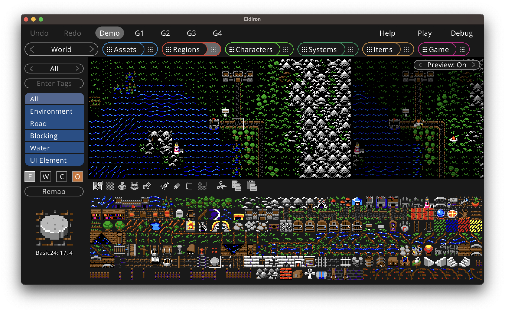
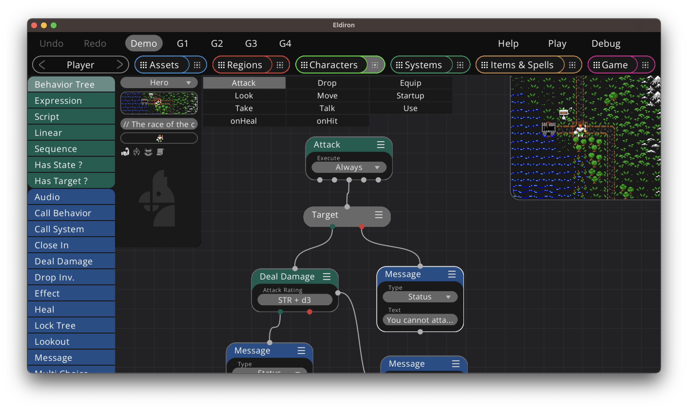

Classic RPG Creation

---

### Rewrite of the Creator in Progress

After v0.8.2 I decided to rewrite the Creator part of Eldiron.

While I was very happy with the underlying systems, especially the heart of it all, the behavior node system, I was not happy with the UI of the Creator itself.

The Creator was too disjointed. It is logically structured into different sections but it is not productive (or fun) to create behaviors for characters or items “blind” without connection to their usage in the map / game.

I am currently redoing the Creator with a heavy focus on being map centered, i.e. you create the game interacting with items on the map with live previews / gaming and debugging for every single item.

I think this will make for a much more fun experience as you develop the game interactively on the map instead of developing each item in a vacuum.

The current release still contains the old Creator, while v0.8.5 with the new creator is targetted to be released in the first quarter of 2024.

---

  

[](https://lbesson.mit-license.org/) [](https://shields.io/) [](https://discord.gg/ZrNj6baSZU) [](https://patreon.com/eldiron) [](https://twitter.com/EldironRPG)


<!---
[](https://www.youtube.com/channel/UCCmrO356zLQv_m8dPEqBUfA)
-->

Eldiron is currently under active development and a v1 is planned for 2024. Eldiron is open source and licensed under the MIT.




## Features of v1

* Support games similar to Ultima 4 / 5 or any game which uses a rectangular grid layout.
* Either render tiles directly or in 2.5D using the built in [raycaster](https://github.com/markusmoenig/Raycaster). Games can switch between the two modes at runtime or display both at the same time (for example use the tiles view as a mini-map).
* Eldiron comes with integrated tile-maps or your can use your own square tiles with up to four levels of transparency.
* Single-player or multi-player experiences. Eldiron has a sophisticated multi-threaded server architecture to allow for as many player or NPC characters as possible.
* Procedural dungeons and regions using a dedicated node system.
* Cross platform. Eldiron is written in Rust and can nearly run everywhere, i.e. on the Web, macOS, Windows, Linux, iOS, Android etc. Eldiron Creator can run on any desktop.
* A sophisticated behavior node graph makes creation of AI behavior for NPCs easy. The node system is backed by a full-featured scripting language.
* Eldiron Creator has editors for tile-maps, regions and node based graphs for character behavior, systems (like crafting), items and the overall game logic.

Retro top-down and isometric perspectives as well as low-poly meshes will be supported post v1.

Join the community on [Discord](https://discord.gg/ZrNj6baSZU) to get in contact.

## Goals

* Being able to create games similar to the RPGs of the 80's and 90's.
* Support single-player or multi-player games and even MMOs.
* Over time support more perspectives like top-down and isometric.

## Installation

You can download the current pre-release in [Releases](https://github.com/markusmoenig/Eldiron/releases).

On macOS you can get access to the current Beta via a public [TestFlight Link](https://testflight.apple.com/join/50oZ5yds).

For ArchLinux users, simply add Eldiron from AUR:
```
yay -S eldiron-bin
```

## Building Eldiron Locally

If you have [Rust installed](https://www.rust-lang.org/tools/install), you can build Eldiron Creator simply via
```cargo build --release --bin creator_main```

Linux:

 Make sure these dependencies are installed: `libasound2-dev` `libatk1.0-dev` `libgtk-3-dev`

## Supporting Eldiron

You can support the Eldiron project by becoming a [Patreon](https://patreon.com/eldiron) or a [GitHub Sponsor](https://github.com/sponsors/markusmoenig).

## License

The source and all assets I commissioned for Eldiron are licensed under the MIT.

Unless explicitly stated otherwise, any contribution intentionally submitted for inclusion in Eldiron, shall be MIT licensed as above, without any additional terms or conditions.

  ## Acknowledgements

* [Aleksandr Makarov](https://twitter.com/iknowkingrabbit) created the tilemaps which are currently shipped with Eldiron, you can see his work on [Twitch](https://iknowkingrabbit.itch.io).

## Sponsors

[](https://www.digitalocean.com/?utm_medium=opensource&utm_source=Eldiron)
