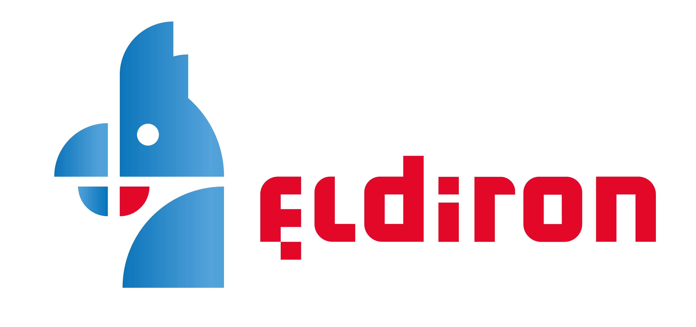

# Eldiron - Classic RPG Creation

       

<!---

-->

Eldiron is currently under active development and a v1 is planned for the first quarter of 2023. Eldiron is open source and licensed under the MIT.

<table><tr>
<td>  </td>
<td>  </td>
<td>  </td>
</tr></table>

## Features of v1

* Support games similar to Ultima 4 / 5 or any game which uses a rectangular grid layout.
* Eldiron comes with integrated tile-maps or your can use your own square tiles with up to four levels of transparency.
* Single-player or multi-player experiences. Eldiron has a sophisticated multi-threaded server architecture to allow for as many player or NPC characters as possible.
* Cross platform. Eldiron is written in Rust and can nearly everywhere, i.e. Web, macOS, Windows, Linux, iOS, Android etc. Eldiron creator can run on any desktop.
* A sophisticated behavior node graph makes AI behavior for NPCs easy. The node system is backed by a full-featured scripting language.
* Eldiron Creator has editors for tile-maps and node based graphs for character behavior, systems (like crafting), items and the overall game logic.

Retro 3D dungeons and regions will be supported in either v1 or v1.5. I am working on a [procedural language](https://github.com/markusmoenig/RPU) just for that.

Once Eldiron is in early-access you can download it here or on Steam.

Join the community on [Discord](https://discord.gg/ZrNj6baSZU) to get in contact.

## Goals

* Being able to create games similar to the RPGs of the 80's and 90's.
* Support single-player or multi-player games and even MMOs.

## Eldiron Book

I am currently working on the [Eldiron Book](https://book.eldiron.com). Please refer to the Book for more detailed information on the creator, the server and clients and the overall project.

## Supporting Eldiron

You can support the Eldiron project by becoming a [Patreon](https://patreon.com/eldiron) or a [GitHub Sponsor](https://github.com/sponsors/markusmoenig).

I am working nearly full-time on Eldiron. A donation helps covering some costs, also for servers and databases.

## License

The source and all assets I commissioned for Eldiron are licensed under the MIT. You can use the source and assets freely.

## Acknowledgements

* [Aleksandr Makarov](https://twitter.com/iknowkingrabbit) created the tilemaps which are currently shipped with Eldiron, you can see his work on [Twitch](https://iknowkingrabbit.itch.io).

