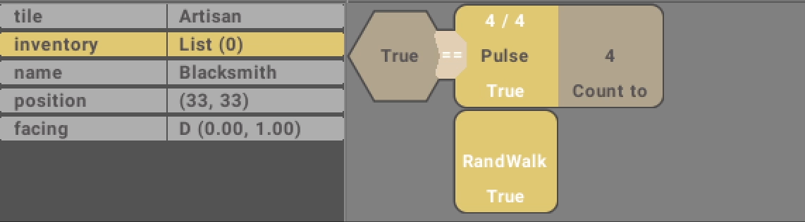
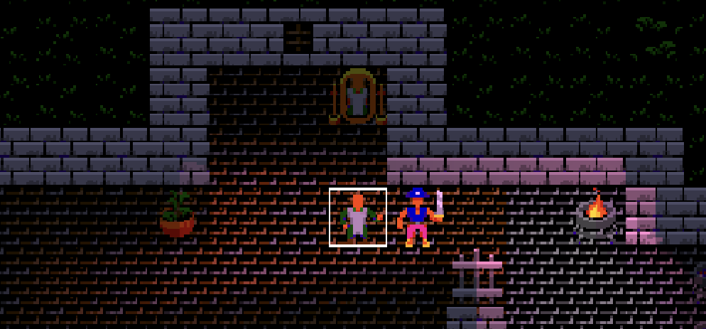
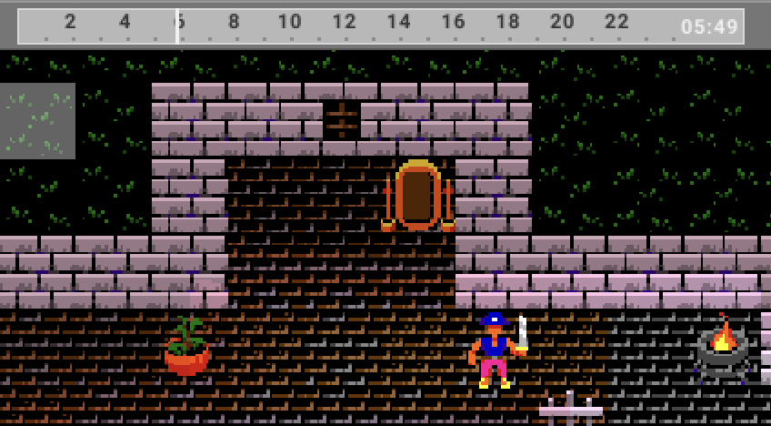
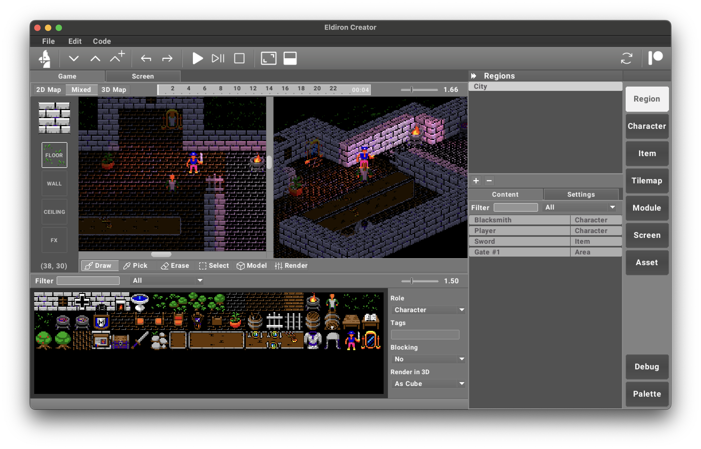

Classic RPG Creation

---

  

[](https://www.youtube.com/channel/UCCmrO356zLQv_m8dPEqBUfA)

[](https://lbesson.mit-license.org/) [](https://shields.io/) [](https://discord.gg/ZrNj6baSZU) [](https://twitter.com/MarkusMoenig)

# Eldiron: A Next-Generation Classical RPG Creator

## Vision

Eldiron focuses on making the creation of classic RPGs easier and more enjoyable by combining the charm of old-school games with modern technology. Our goal is to provide creators with a flexible and user-friendly platform, enabling them to design immersive and dynamic worlds for players to explore.

## Core Features

### Create worlds using tiles or model with geometrical shapes and nodes.

Either draw in pixel-perfect precision using 2D tilemaps or model worlds procedurally in 2D and 3D using geometrical shapes and procedural materials.

In 3D graphics get pre-rendered utilizing an integrated Disney BSDF pathtracer.

Eldiron also ships with an integrated Ultima like tilemap to get you started.


### Grid based Visual Coding System



Code character and game behavior in a grid based visual node system. Combining the power and speed of real code with the ease of use and visual debugging of a true node system.


### Visual effects made easy

You can easily add visual effects to your world. Imagine placing light sources, animating gates or adding mirror effects. To name just a few.

.

### Time based behavior

Everyting in Eldiron is driven by a 24 hour timeline. Define time based character behavior, open gates or passages at given times or modify the world by estinguishing light sources during the day.

Worls created by Eldiron are not static but dynamic in every possible way.



### Render your worlds the way you like it

Eldiron provides a vast array of rendering options, either classical 2D tiles or fan favourite first person or top down perspectives like isometric top down views or even tilted perspectives like in Ultima 6 / 7.

Define rendering options per region to be able to seamlessly switch between different views.



... and much more like the upcoming multi-player / server support.

### Supporting Eldiron

If you want to help me on my Eldiron mission, please consider becoming a [Patreon](https://patreon.com/eldiron) or a [GitHub Sponsor](https://github.com/sponsors/markusmoenig).

---

I will start documenting the Eldiron progress and provide tutorials soon on YouTube. So please make sure to like and subscribe to my [channel](https://www.youtube.com/channel/UCCmrO356zLQv_m8dPEqBUfA).

Also consider joining the community on [Discord](https://discord.gg/ZrNj6baSZU) to get in contact.

## Installation

You can download the current pre-release in [Releases](https://github.com/markusmoenig/Eldiron/releases).

On macOS you can get access to the current Beta via a public [TestFlight Link](https://testflight.apple.com/join/50oZ5yds).

For ArchLinux users, simply add Eldiron from AUR:

```
yay -S eldiron-bin
```

## Building Eldiron Locally

If you have [Rust installed](https://www.rust-lang.org/tools/install), you can build Eldiron Creator simply via
`cargo build --release --bin eldiron`

Linux:

Make sure these dependencies are installed: `libasound2-dev` `libatk1.0-dev` `libgtk-3-dev`

## License

The source and all assets I commissioned for Eldiron are licensed under the MIT.

Unless explicitly stated otherwise, any contribution intentionally submitted for inclusion in Eldiron, shall be MIT licensed as above, without any additional terms or conditions.

## Acknowledgements

- [Aleksandr Makarov](https://twitter.com/iknowkingrabbit) created the tilemaps which are currently shipped with Eldiron, you can see his work on [Twitch](https://iknowkingrabbit.itch.io).

## Sponsors

[](https://www.digitalocean.com/?utm_medium=opensource&utm_source=Eldiron)
