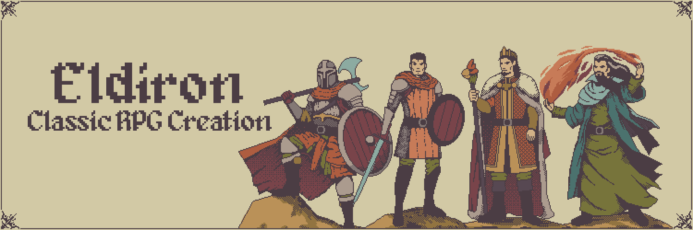
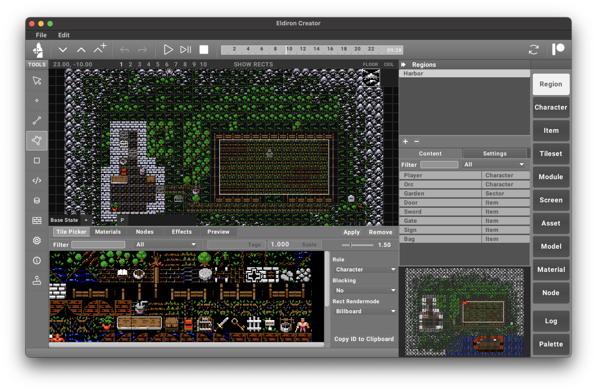
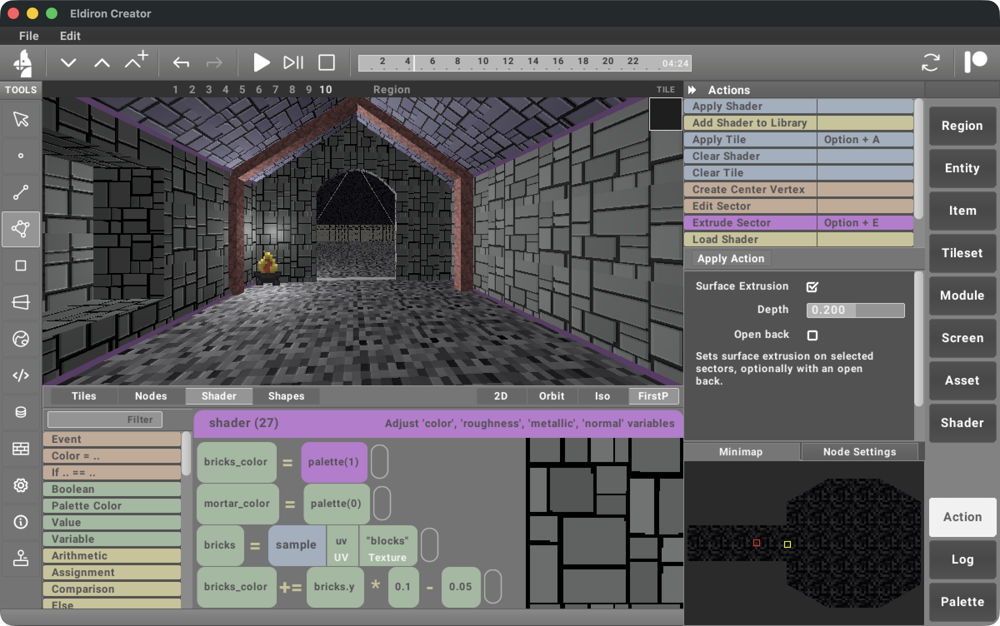

# Eldiron: A Next-Generation Classical RPG Creator



---

  

[](https://www.youtube.com/channel/UCCmrO356zLQv_m8dPEqBUfA)

[](https://lbesson.mit-license.org/) [](https://shields.io/) [](https://discord.gg/ZrNj6baSZU) [](https://twitter.com/MarkusMoenig)

**Eldiron** is a cross-platform creator for classic retro role-playing games (RPGs). Its primary goal is to enable the creation of RPGs reminiscent of the 1980s and 1990s while incorporating modern features such as multiplayer support, procedural content generation, and more.

Eldiron natively supports **2D** (like Ultima 4/5), **isometric**, and **first-person** RPGs, allowing developers to craft a variety of experiences effortlessly.

Eldiron is open-source and licensed under the **MIT License**.

For a more detailed feature overview please visit [Eldiron.com](https://eldiron.com)

2D Example           | 3D Example
:-------------------------:|:-------------------------:
  |  

## Source Code

Eldiron is built on three embedded crates that I have developed over the last years. Each focuses on a specific aspect of the engine and editor, and together they form the foundation of the Eldiron ecosystem.

- **TheFramework**
  Handles cross-platform window creation, user event abstraction, and the custom UI system used by *Eldiron Creator*.

- **Rusterix**
  Started as a software rasterizer for 2D and 3D geometry, but has since evolved into the core game engine. While *SceneVM* now handles most rendering tasks, the software rasterization aspect of Rusterix is still used for example in in-game UI elements.

- **SceneVM**
  An abstracted, layer-based renderer for 2D and 3D built on top of [wGPU](https://wgpu.rs). Each layer can define its own geometry and compute shaders, making SceneVM the main rendering backbone of Eldiron.

Over the past five years, Eldiron has gone through several major iterations. As a result, some parts of the code are in the process of being consolidated or phased out as the project moves toward a cleaner v1 architecture.

---

## Installation

### Pre-built Binaries

Download the latest release for your platform from the [GitHub Releases](https://github.com/markusmoenig/Eldiron/releases) page.

### Install via Cargo

If you have [Rust installed](https://www.rust-lang.org/tools/install), you can install Eldiron Creator and the Client directly from [crates.io](https://crates.io):

```bash
cargo install eldiron-creator
cargo install eldiron-client
```

### Building from Source

Clone the repository and build:

```bash
git clone https://github.com/markusmoenig/Eldiron
cd Eldiron
cargo run --release --package creator
```

### Linux Dependencies

Make sure these dependencies are installed: `libasound2-dev` `libatk1.0-dev` `libgtk-3-dev`

## License

The source and all assets I commissioned for Eldiron are licensed under the MIT.

Unless explicitly stated otherwise, any contribution intentionally submitted for inclusion in Eldiron, shall be MIT licensed as above, without any additional terms or conditions.

---

## Sponsor

If you’d like to support the **Eldiron** project, please consider joining my [Patreon](https://www.patreon.com/eldiron), join my [GitHub Sponsor](https://github.com/markusmoenig) or send a [Donation](https://www.paypal.me/markusmoenigos). Your support helps me continue development, commission tilesets, host databases and forums, and more.
