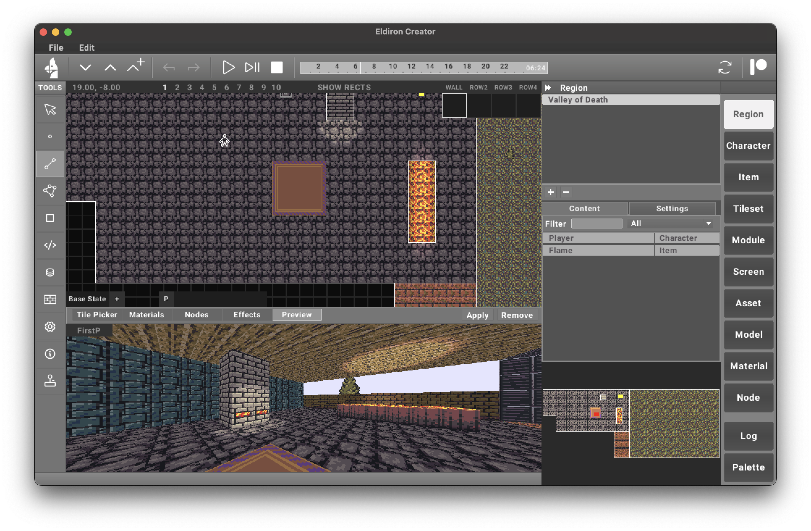

# Eldiron: A Next-Generation Classical RPG Creator

---

  

   

**Eldiron** is a cross-platform creator for classic retro role-playing games (RPGs). Its primary goal is to enable the creation of RPGs reminiscent of the 1980s and 1990s while incorporating modern features such as multiplayer support, procedural content generation, and more.

Eldiron natively supports **2D** (like Ultima 4/5), **isometric**, and **first-person** RPGs, allowing developers to craft a variety of experiences effortlessly.

Eldiron is open-source and licensed under the **MIT License**.

2D Example           | 3D First Person Example
:-------------------------:|:-------------------------:
  |  

---

## Building Eldiron Locally

If you have [Rust installed](https://www.rust-lang.org/tools/install), you can build Eldiron Creator simply via
`cargo build --release --package creator`

Linux:

Make sure these dependencies are installed: `libasound2-dev` `libatk1.0-dev` `libgtk-3-dev`

## License

The source and all assets I commissioned for Eldiron are licensed under the MIT.

Unless explicitly stated otherwise, any contribution intentionally submitted for inclusion in Eldiron, shall be MIT licensed as above, without any additional terms or conditions.

<!-- - The starter project uses the great [resurrect-64-palette](https://lospec.com/palette-list/resurrect-64). -->

---

## Sponsor

If you’d like to support the **Eldiron** project, please consider joining my [Patreon](https://www.patreon.com/eldiron), join my [GitHub Sponsor](https://github.com/markusmoenig) or send a [Donation](https://www.paypal.me/markusmoenigos). Your support helps me continue development, commission tilesets, host databases and forums, and more.
