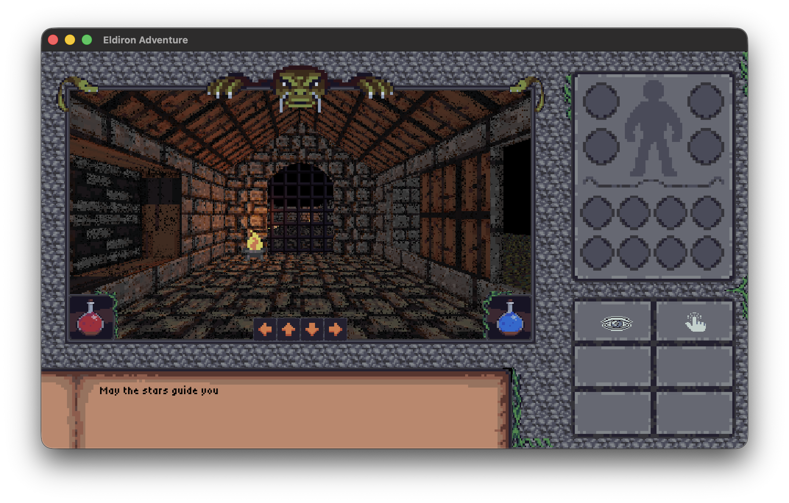

# Eldiron Client

**Eldiron Client** is the player client for games created with [Eldiron](https://eldiron.com), an open-source creator for classic retro role-playing games (RPGs). Eldiron enables the creation of RPGs reminiscent of the 1980s and 1990s while incorporating modern features such as multiplayer support, procedural content generation, and more.

Eldiron natively supports **2D** (like Ultima 4/5), **isometric**, and **first-person** RPGs.



For more information visit [Eldiron.com](https://eldiron.com) or the [GitHub repository](https://github.com/markusmoenig/Eldiron).

```bash
cargo install eldiron-client
```

## License

Licensed under the MIT License.
