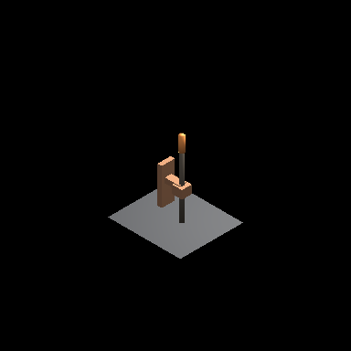

# buildergraph

`buildergraph` is Eldiron's reusable prop and structural-assembly crate.

It contains:

- the text-based `.buildergraph` document format
- parsing and evaluation for builder scripts and graph documents
- serializable host contracts and assembly IR
- a preview renderer for quick in-editor feedback
- built-in presets such as tables, wall torches, wall lanterns, and campfires



## What It Is

`buildergraph` is used for authoring reusable 3D assemblies that can be attached to different host types inside Eldiron.

Typical uses include:

- furniture such as tables
- wall-mounted props such as torches and lanterns
- floor props such as campfires
- edge-based structures such as rails or fences

Builder assets can expose:

- geometry
- future cut masks and static billboard batches
- named material slots
- named item slots
- a host target such as surface, sector, linedef, vertex, object, or terrain

That makes one builder reusable across many placements and material setups.

## Script Example

Builder scripts are intentionally human-readable:

```txt
name = "Wall Torch";
host = vertex;

preview {
    width = 1.0;
    depth = 0.4;
    height = 2.0;
}

let plate = box {
    attach = host.middle + host.out * 0.03;
    size = vec3(0.18, 0.28, 0.05);
    material = BASE;
};

slot material base_mat = plate.center;
output = [plate];
```

Surface/detail scripts can also emit cut masks into the assembly IR:

```txt
cut rect {
    min = vec2(0.0, 0.5);
    max = vec2(host.width, host.height);
    mode = cut_overlay;
};
```

Supported cut modes are `cut`, `replace`, and `cut_overlay`.
Cut coordinates are host-local detail coordinates; for surface/detail hosts, `(0, 0)` maps to the selected surface bounds minimum.

Decorative surface output should use `detail` blocks. This keeps the boolean mask separate from the visible detail geometry:

```txt
detail rect {
    min = vec2(host.width * 0.20, host.depth * 0.20);
    max = vec2(host.width * 0.80, host.depth * 0.80);
    offset = -0.05;
    inset = 0.20;
    shape = border;
    material = TRIM;
    tile_alias = wood;
};
```

Column-like surface details can be declared as `detail column`; these are IR entries for the renderer/chunk builder to mesh as pilasters or rounded columns:

```txt
detail column {
    center = vec2(host.width * 0.25, host.depth * 0.10);
    height = host.depth * 0.80;
    radius = 0.28;
    offset = -0.12;
    base = 0.0;
    cap = 0.0;
    segments = 16;
    material = COLUMN;
    tile_alias = stone;
};
```

## Library Use

The crate can parse either script-based or node-graph-based builder documents:

```rust
use buildergraph::BuilderDocument;

let source = std::fs::read_to_string("examples/table.buildergraph")?;
let document = BuilderDocument::from_text(&source)?;
let preview = document.render_preview(256);

assert!(preview.width > 0);
# Ok::<(), Box<dyn std::error::Error>>(())
```

To evaluate against an explicit host and inspect the assembly IR:

```rust
use buildergraph::{BuilderDocument, BuilderHost};

let source = std::fs::read_to_string("examples/table.buildergraph")?;
let document = BuilderDocument::from_text(&source)?;
let host = BuilderHost::preview_wall(6.0, 3.0, 0.3);
let assembly = document.evaluate_with_host(&host)?;

assert!(!assembly.primitives.is_empty());
# Ok::<(), Box<dyn std::error::Error>>(())
```

## CLI

```sh
buildergraph check examples/table.buildergraph
buildergraph inspect examples/table.buildergraph
buildergraph eval examples/table.buildergraph --host wall --width 6 --height 3 --thickness 0.3
buildergraph eval examples/table.buildergraph --host-json host.json --out assembly.json
buildergraph surface examples/surface_border.buildergraph --host floor --width 6 --depth 2.5
buildergraph surface examples/surface_border.buildergraph --host floor --width 6 --depth 2.5 --png
buildergraph surface examples/surface_border.buildergraph --host floor --width 6 --depth 2.5 --watch
```

The `eval` command emits assembly JSON so procedural output can be tested and debugged outside the editor.
The `surface` command prints resolved cut loops and replacement patch details, including fill/border shape, offset, inset, and side-wall expectations. With `--png`, it also writes a simple 2D surface preview image. With `--watch`, it regenerates the default PNG whenever the source file changes.

## Scope

`buildergraph` is primarily designed for Eldiron's Builder Tool workflow. The format is still evolving, but the goal is clear: readable, reusable structural assets that can be previewed and instanced quickly.
