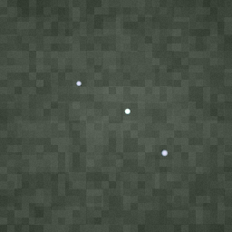

# organicgraph

`organicgraph` is Eldiron's organic brush graph crate for paint, growth, and path-style brush assets.

It contains:

- the reusable organic brush graph data model
- built-in presets such as moss, mud, grass, bush, tree, and vines
- preview rendering for organic brush assets



## What It Is

`organicgraph` is used for authoring soft, irregular, and naturally-shaped brush assets that do not fit a rigid tile or hard-surface workflow.

Typical outputs include:

- moss
- mud
- grass
- bushes
- trees
- vines

The crate focuses on reusable brush graphs that can be previewed quickly and tuned through recipe-like parameters such as shape, noise, scatter, height, palette selection, and output behavior.

## Presets

The crate already ships with several ready-to-use presets:

- `OrganicBrushGraph::preset_moss()`
- `OrganicBrushGraph::preset_mud()`
- `OrganicBrushGraph::preset_grass()`
- `OrganicBrushGraph::preset_bush()`
- `OrganicBrushGraph::preset_tree()`
- `OrganicBrushGraph::preset_path_vines()`

## Library Use

```rust
use organicgraph::OrganicBrushGraph;

let graph = OrganicBrushGraph::preset_moss();
let preview = graph.render_preview(256);

assert!(preview.width > 0);
# Ok::<(), Box<dyn std::error::Error>>(())
```

## Scope

`organicgraph` is primarily intended for Eldiron's terrain and brush workflows. It is still a focused crate rather than a general-purpose procedural art framework, but it already provides a compact reusable foundation for natural brush assets.
