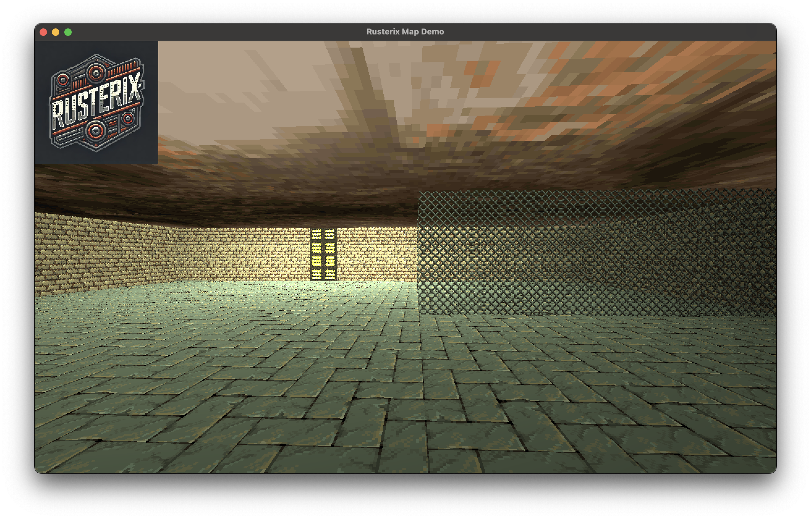
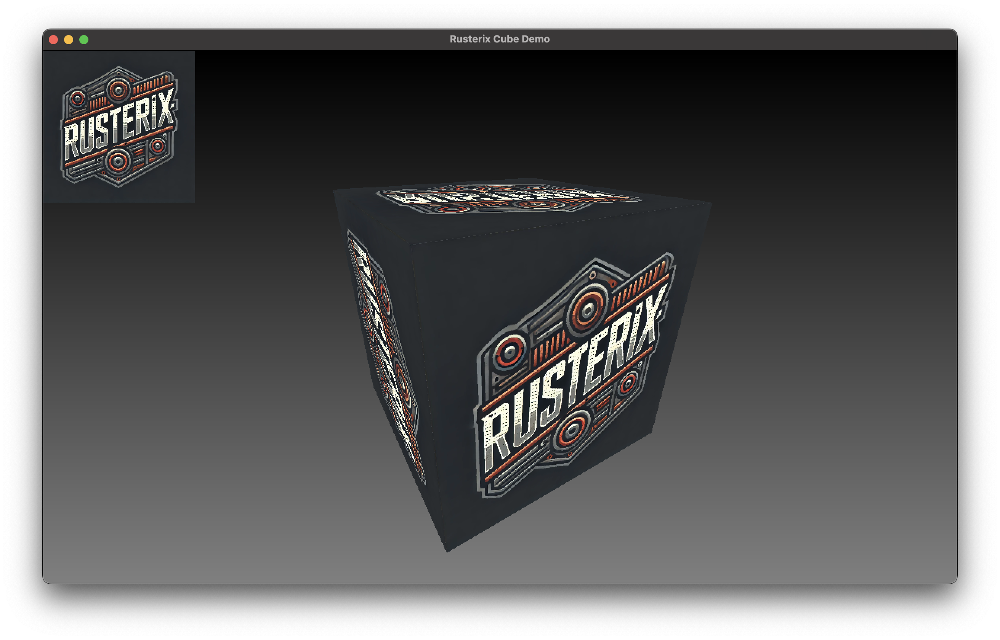
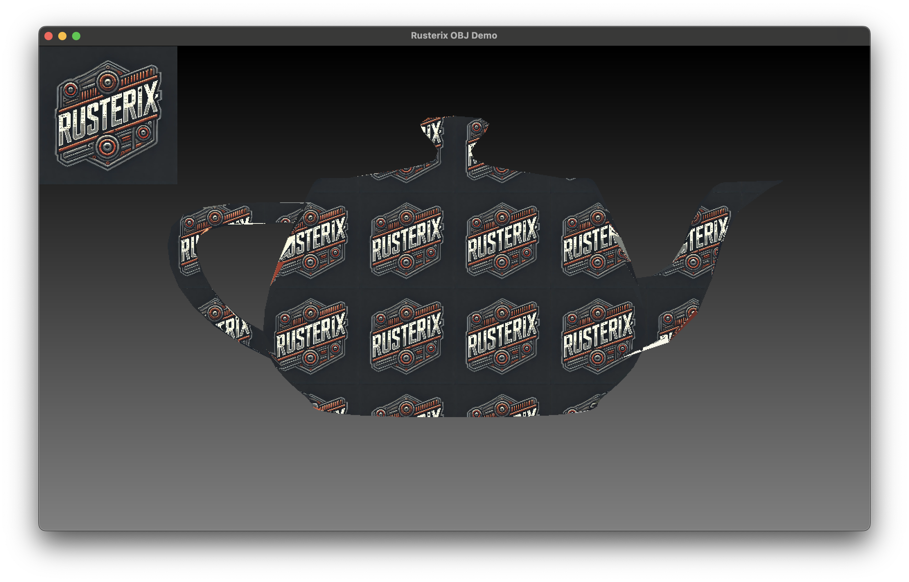

Rusterix is a fast software renderer and a retro game engine with support for procedural content.

---

## How it works

Rusterix uses a multi-threaded, tile-based renderer and organizes 2D and 3D meshes into batches. It precomputes the bounding boxes and triangle edges for each batch during projection.

The main goal is to achieve a single rendering pass to maximize parallelization. The batching system makes this possible while also enabling grouping and optimizations for individual objects and content.

Because of these optimizations, Rusterix is not a general-purpose abstraction of a hardware rendering pipeline (for that, consider using the excellent [euc](https://github.com/zesterer/euc)). Instead, it features a custom pipeline specifically optimized for software rendering and operates within a fixed color space.

Rendering a rectangle and a 3D cube is as easy as:

```rust
// Create a scene with a static 2D rectangle and a box
let scene = Scene::from_static(
    vec![Batch::from_rectangle(0.0, 0.0, 200.0, 200.0)],
    vec![Batch::from_box(-0.5, -0.5, -0.5, 1.0, 1.0, 1.0).sample_mode(SampleMode::Nearest)],
)
.background(Box::new(VGrayGradientShader::new())) // Apply a background shader
.textures(vec![Tile::from_texture(Texture::from_image(Path::new("images/logo.png")))]); // And add a tile with one texture

// Create a camera
let camera = D3OrbitCamera::new();

let width = 800;
let height = 600;
let mut pixels = vec![0; width * height * 4];

// Rasterize the scene
Rasterizer::setup(
    None, // No 2D projection matrix
    self.camera.view_matrix(),
    self.camera
        .projection_matrix(ctx.width as f32, ctx.height as f32),
)
.rasterize(
    &mut self.scene,
    pixels,  // Destination buffer
    width,
    height,
    200,     // Tile size used per thread
);
```

## Rusterix as a Game Engine (WiP)

Rusterix has built in procedural map generation and entity management. The map for the above screenshot was built with the following script in the `minigame` folder. The game engine is not yet fully functional and is under development.

```python
set("sky_tex", "sky")

set_default("wall_tex", "brickwall")
set_default("floor_tex", "brickfloor")
set_default("wall_height", 2.0)

box_size = 15

# big room
wall(box_size)
turn_right()
wall(box_size)
turn_right()
wall(5)
wall(1)
set("wall_tex", "lightpanel")
add_point_light("#ffffbb", 2.0, 2.0, 13.0)
wall(9)
turn_right()
wall(box_size)

# fenced area consisting of 2 walls
set_default("wall_tex", "fence")
move_to(6, box_size)
wall(6)
turn_left()
wall(6)
```

Documentation for Rusterix will be provided soon at Rusterix.com.

## Goals and Status

Once finished, you will be able to use Rusterix in several different ways:

* As a library to rasterize 2D and 3D meshes, WIP. See the `Cube` and `Obj` examples.
* As a retro game engine with text driven content, like Doom style map generation using Python based scripts.

My goals for both of these use cases:

* Fast software based rendering.
* Procedural materials and particles for in game effects and content.
* Texture based and procedural entities / characters.

## Implemented Features

* Fast software-based rendering.
* Supports batches of 2D and 3D geometry, each with configurable parameters (e.g., DrawMode, SamplingMode, CullingMode, RepeatMode, TextureIndex, etc.).
* Shaders can be applied to the screen or individual batches.
* Optional distance based UV jittering for avoiding Moire patterns.
* Point, Distance, Spot and Area lights.
* Modular, trait based Orbit, Isometric and First Person cameras.

## Motivation

I use `rusterix` as the rendering engine for my [Eldiron](https://github.com/markusmoenig/Eldiron) project. But it makes sense to split it out into a re-usable library and engine.

## Examples

To execute an example just do something like ```cargo run --release --example cube```.

* **cube** displays a textured cube. 

* **obj** demonstrates how to load and display an obj file. 

* **map** displays the map scene above. Walk around using the WASD keys.

## Disclaimer

Rusterix is an independent project and is not affiliated with or endorsed by the Rust programming language team or the Rust Foundation. All trademarks are the property of their respective owners.

## License

`rusterix` is distributed under either of:

- Apache License, Version 2.0, (LICENSE-APACHE or http://www.apache.org/licenses/LICENSE-2.0)

- MIT license (LICENSE-MIT or http://opensource.org/licenses/MIT)

at the discretion of the user.
