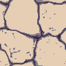

# tilegraph

`tilegraph` is Eldiron's procedural tile graph crate for generating retro tiles and multi-tile groups for walls, floors, materials, and effects.

It contains:

- the human-readable `.tilegraph` document format
- parsing and conversion into the runtime graph format
- the graph runtime and renderer
- support for multi-tile grouped output
- particle and light-oriented graph workflows used by Eldiron



## What It Is

`tilegraph` is built around a height-first workflow for procedural retro tile generation.

Typical flow:

1. layout nodes generate structural fields such as `Height`, `Center`, and `Cell Id`
2. shaping nodes sculpt the field
3. color nodes map the result to palette colors
4. output writes color, height, material, particle, and light data

The resulting graph can generate:

- a single tile
- a grouped output such as `2x2` or `3x3`
- height-driven material sheets
- particle- and light-related output used by Eldiron's editor/runtime workflows

## Format

The portable graph format is TOML-based and intended to stay readable and diffable.

```toml
[node.voronoi.main]
scale = 0.349
seed = 11

[node.output.main]
color = "colorize4.main:field"
height = "subtract.main:field"
```

## Library Use

```rust
use tilegraph::{TileGraphDocument, TileGraphRenderer};

let source = std::fs::read_to_string("examples/stones.tilegraph")?;
let doc = TileGraphDocument::from_toml_str(&source)?;
let exchange = doc.to_exchange()?;
let renderer = TileGraphRenderer::new(doc.palette.parsed_colors());
let rendered = renderer.render_graph(&exchange);

assert!(!rendered.sheet_color.is_empty());
# Ok::<(), Box<dyn std::error::Error>>(())
```

## CLI

The package also contains a CLI binary:

```bash
cargo run -p tilegraph -- crates/tilegraph/examples/stones.tilegraph
```

This renders the graph to color/material output sheets and per-tile images.

## Scope

`tilegraph` is designed first for Eldiron's procedural tile workflow, but the format is intentionally plain and portable enough to stay useful outside the editor as well.
