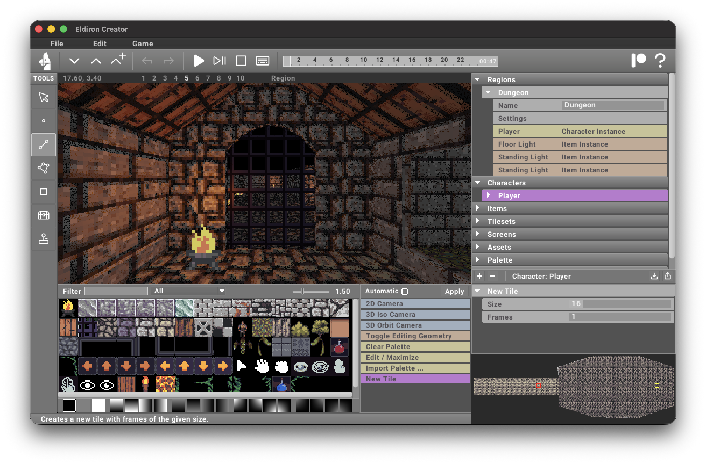

# Eldiron Creator

**Eldiron** is a cross-platform creator for classic retro role-playing games (RPGs). Its primary goal is to enable the creation of RPGs reminiscent of the 1980s and 1990s while incorporating modern features such as multiplayer support, procedural content generation, and more.

Eldiron natively supports **2D** (like Ultima 4/5), **isometric**, and **first-person** RPGs, allowing developers to craft a variety of experiences effortlessly.



Eldiron is open-source and licensed under the **MIT License**.

For a more detailed feature overview please visit [Eldiron.com](https://eldiron.com) or the [GitHub repository](https://github.com/markusmoenig/Eldiron).

```bash
cargo install eldiron-creator
```

## License

Licensed under the MIT License.
