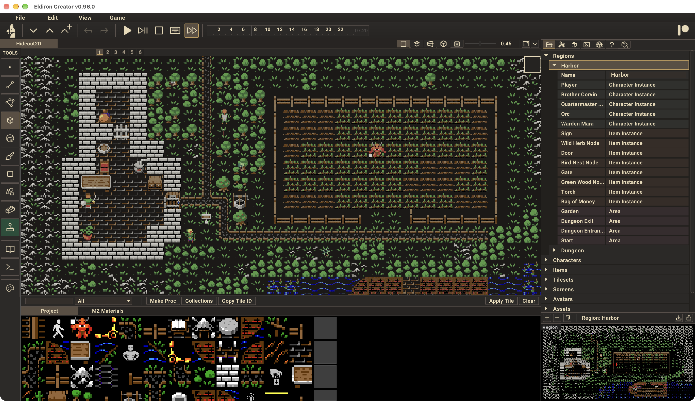
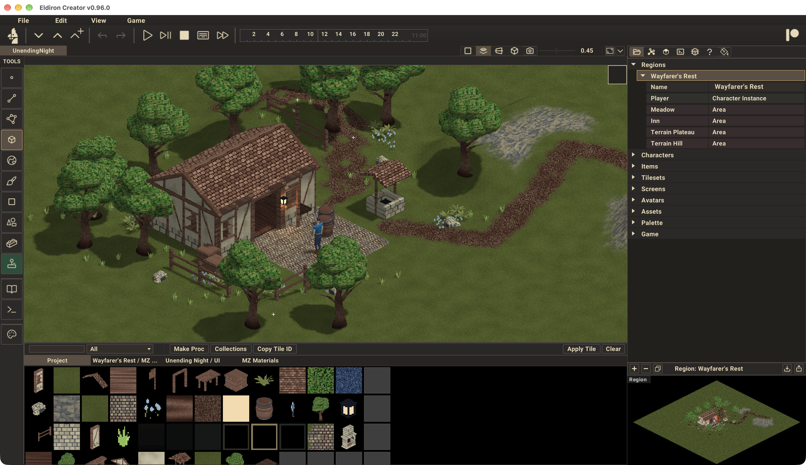
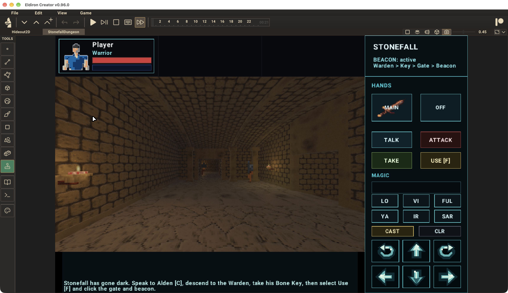

# Eldiron Creator

**Eldiron** is a cross-platform creator for classic retro role-playing games (RPGs). Its primary goal is to enable the creation of RPGs reminiscent of the 1980s and 1990s while incorporating modern features such as multiplayer support, procedural content generation, and more.

Eldiron natively supports **2D** (like Ultima 4/5), **isometric**, and **first-person** RPGs, allowing developers to craft a variety of experiences effortlessly.

The embedded MaterialZ (MZ) core adds editable procedural world materials,
shape-based map composition, ruleset item icons, clothing, models and rigs.
The same project-palette artwork supports 2D sprites and native 3D meshes.
Bitmap tiles and avatars remain supported. See the
[material guide](../docs/docs/building_maps/procedural_materials.md) and
[appearance guide](../docs/docs/characters_items/appearance.md).

| 2D · Hideout | 2D Iso · Wayfarer's Rest | 3D · Stonefall Dungeon |
| :---: | :---: | :---: |
|  |  |  |

Eldiron is open-source and licensed under the **MIT License**.

For a more detailed feature overview please visit [Eldiron.com](https://eldiron.com) or the [GitHub repository](https://github.com/markusmoenig/Eldiron).

```bash
cargo install eldiron-creator
```

## License

Licensed under the MIT License.
