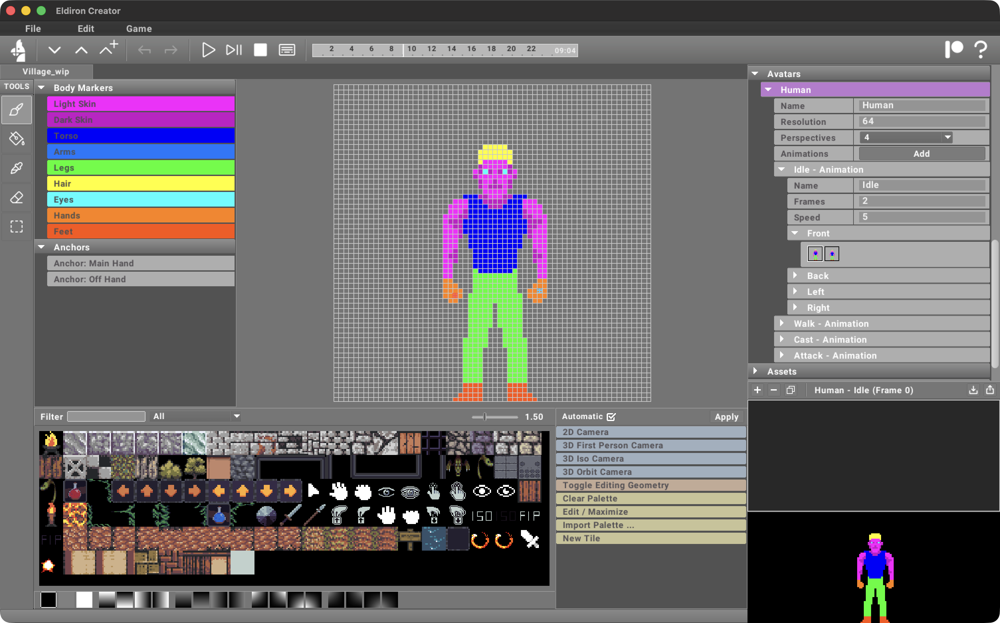
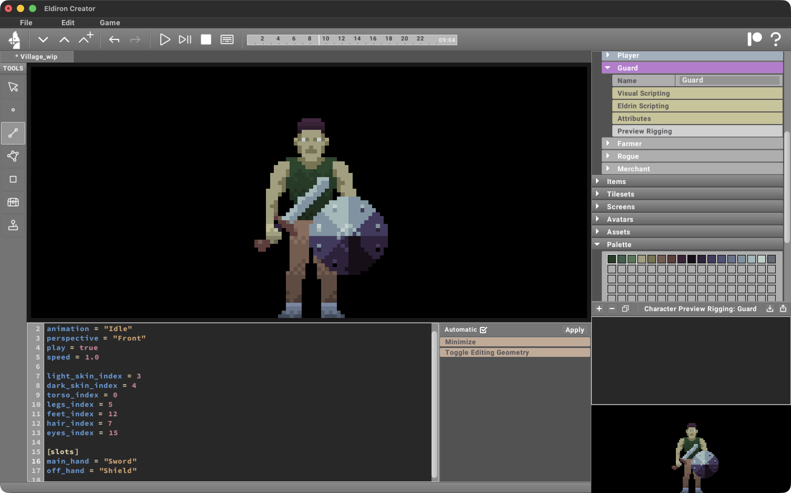

<!-- truncate -->

Eldiron v0.9 introduces several major new features, including the new **Avatar system** with skinnable and riggable characters, a completely redesigned spellcasting system, new procedural mesh generation options, audio support, and much more. While a few pieces are still missing, the core building blocks for the upcoming **v1 release** are now in place.

## Avatars

Avatars are animated pixel characters that you can create, edit, and animate directly inside Eldiron. Body parts are painted using specific template colors, which are automatically replaced to support different characters, equipment, and appearances.

Animations can be either **front-facing (2D)** or support **up to four directions** for 3D-style movement. They are triggered automatically based on in-game actions such as **Idle**, **Walk**, **Attack**, and **Cast**.

You can also define **weapon anchor points** for both the main hand and off-hand.

A dedicated **character preview** allows you to instantly see how weapons and items appear on your characters.

## Spells

The new spell system lets you bind spell-based items to buttons on your screens. Spells can launch projectiles such as fireballs at targets and include configurable projectile graphics, explosions, and built-in previews.

## Procedural Mesh Creation

Built-in actions allow you to create 3D props such as palisades, fences, terrain features, roads, and furniture procedurally.

## And Much More

There are many more improvements in this release. Browse the documentation on this site to explore all the new features, and stay tuned for upcoming tutorial videos on the Eldiron YouTube channel where I’ll cover them in more detail.

More features and refinements are already planned as Eldiron continues to move toward the v1 release.
