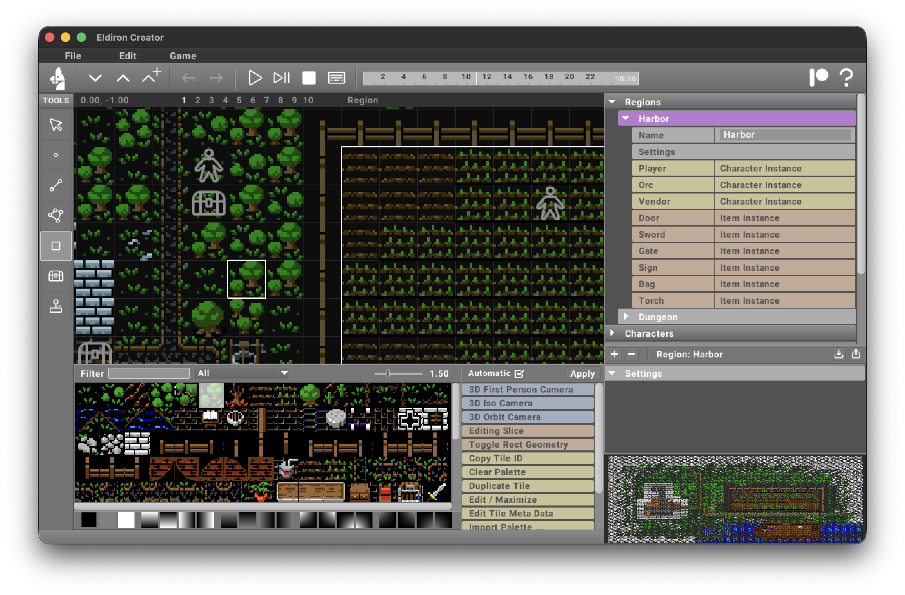
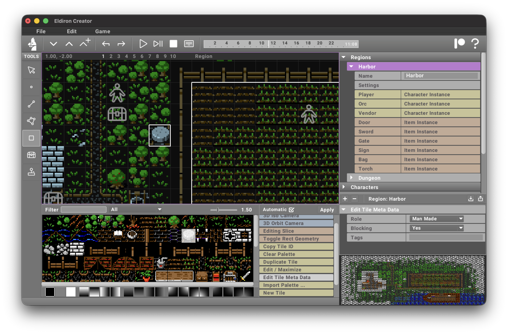

2D maps are mostly created using the [Rect](/docs/creator/tools/rect) tool. It allows you to draw tiles directly onto the map by creating a rectangular sector and applying the currently selected tile to it.

The *Rect* tool in action.



The *Rect* tool does not layer tiles. When you draw over an existing tile, the tile will be replaced with the new tile. Holding *Shift* while drawing removes tiles.

## Blocking Tiles

One important difference between 2D and 3D maps is how to create blocking areas, i.e. areas or tiles characters cannot enter. In 3D these are defined by the height of the surrounding 3D geometry, like a wall. But we do not have 3D heights in 2D maps, making it necessary to define exactly which tile is blocking and which is not.



We can do this with the [Edit Tile Meta](/docs/creator/actions/#edit-tile-meta) action, select **Yes / No** for the *Blocking* state (default is not blocking). Dont forget to click **Apply** if you do not have the **Automatic** mode turned on.

The blocking state for tiles is ignored in 3D maps.

## Named Sectors

Apart from drawing the visual appearance via the *Rect* tool, it is still important to create named sectors on the map (using the [Linedef](/docs/creator/tools/linedef) tool) for game logic.

Named sectors (i.e. sectors which have a name), can be used in many different ways:

- The ```random_walk_in_sector``` command randomly walks NPC characters inside a given sector.
- The ```goto``` command uses pathfinding to walk an NPC character to the given destination sector.
- When a character enters or leaves a sector, an **entered** or **left** event is send to the character with the name of the sector (allowing the character to take specific action).

For example the *"Garden"* sector shown in the above screenshots (the white outlines) is used to randomly walk an **Orc** who is looking for the player. And if he killed the player and is outside the garden walks back to the garden via ```goto```, once back there he receives an **arrived** event and can resume his normal routine.

## Moving a Decorated Sector

Sectors have another important feature. When you draw tiles for decoration inside the sector (lets say a house), you can move the sector (with all subsectors and tiles) by holding *Cmd/Ctrl* in the [Sector](/docs/creator/tools/sector) tool. This allows you to create objects on the map which you can move all at once when the map changes.
