import Admonition from '@theme/Admonition';

## Creating Walls

Every structure starts with a foundation. Let’s create a **sector**.

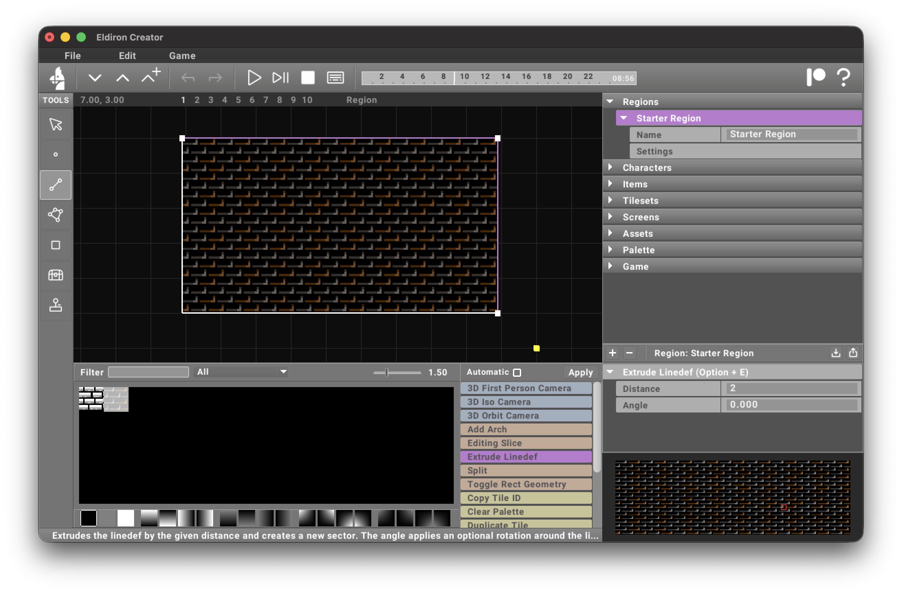

I selected the back and right **linedefs** of the **sector** and chose the [Extrude Linedef](/docs/creator/actions/#extrude-linedef) action, which extrudes a linedef (by a given distance and angle) into a new **surface**.

<Admonition type="note" title="Surface">
    A **surface** is the same as a **sector**, I just use it to differentiate flat 2D sectors from 3D ones.
</Admonition>

Applying the [Extrude Linedef](/docs/creator/actions/#extrude-linedef) action creates two new **surfaces** with the linedefs as their basis.

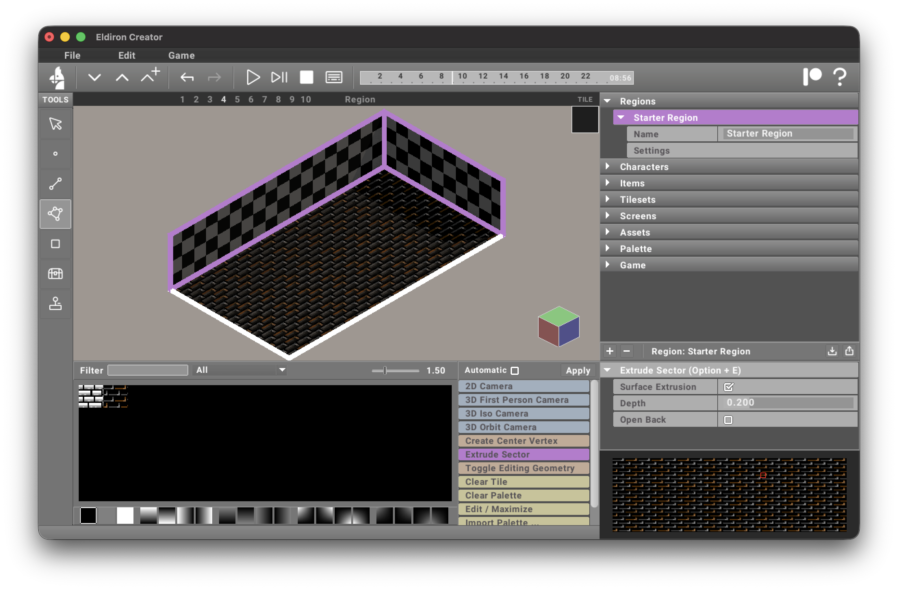

I also used the [3D Iso Camera](/docs/creator/actions/#3d-iso-camera) action to switch to a 3D view of the scene.

I selected the two **surfaces** we just created and ran the [Extrude Sector](/docs/creator/actions/#extrude-sector) action.

When we *Apply* the tool, the wall now has depth.

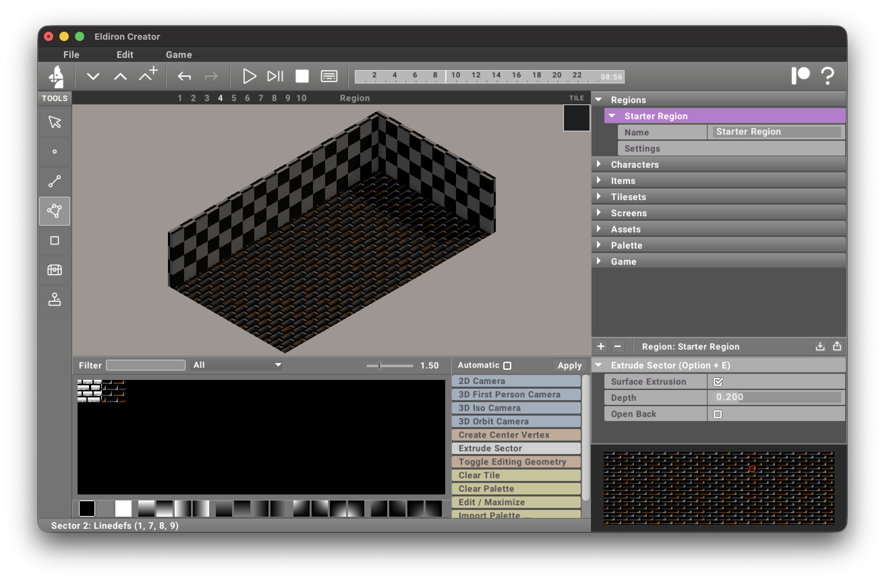

I used the [Toggle Editing Geometry](/docs/creator/actions/#toggle-editing-geometry) action to hide the editing geometry.

<Admonition type="note" title="Non-Destructive Workflow">
    Extrusions are non-destructive. You can change the extrusion depth at any time by reapplying the [Extrude Sector](/docs/creator/actions/#extrude-sector) action—including reverting to no extrusion by setting the depth to 0.0.
</Admonition>

## Cutting Holes

Let’s cut a hole in a wall for a passage. Select the right wall and run the [Set Editing Surface](/docs/creator/actions/#set-editing-surface) action.

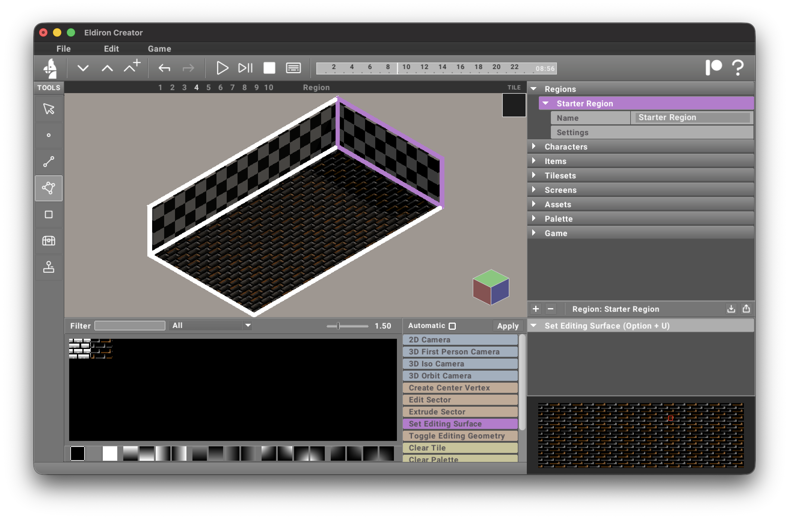

After applying the action (or, if you have *Automatic* mode enabled, simply clicking it), you see the editing profile of the surface.

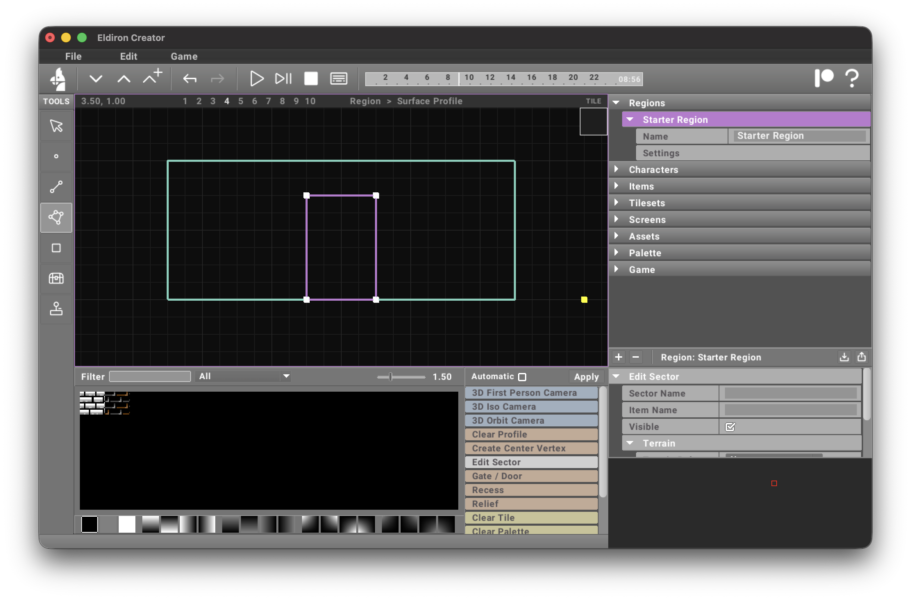

The turquoise outline shows you the boundaries of the surface you are adding profile details into.

Here I added a sector for a door into the profile. Each **sector** you add to a **surface profile** creates a hole by default. When you activate the isometric camera again you can see the result in 3D (I also applied a tile to the walls).

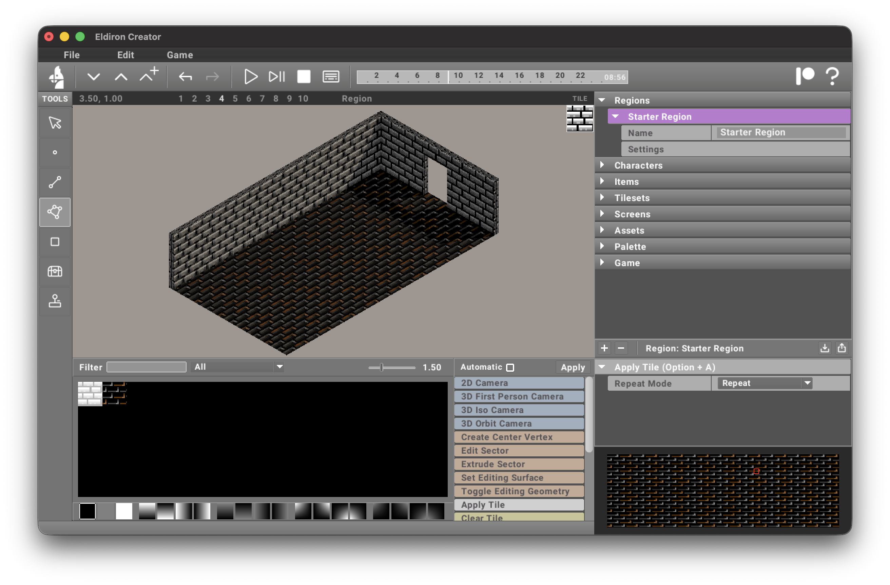

<Admonition type="note" title="Extrusion and holes">
    Holes in profile surfaces are independent from the extrusion of the wall itself. You can change the depth of the wall extrusion and the holes will automatically adjust.
</Admonition>

For a gate, a nice decoration is to select the top **linedef** of the profile and apply the [Arch](/docs/creator/actions/#arch) action to create an arch for the doorway.

You can have any number of holes of any shape, edit the profile geometry for windows or reliefs in any way you want.

## Hole-Based Actions

Instead of just using a **surface profile** as a hole, you can also apply the [Recess](/docs/creator/actions/#recess) and [Relief](/docs/creator/actions/#relief) actions to create a recess and relief of a given depth or height. You can drag and drop tiles for the sides and cap to the given action.

A more sophisticated profile action is [Gate / Door](/docs/creator/actions/#gate--door), which uses the given icon to create a gate or door for the hole. The key is that, by selecting the **sector**, you can use the [Edit Sector](/docs/creator/actions/#edit-sector) action to associate an item for the gate (set **Item Name** to the name of the **Item Template**). In the item behavior code you can then dynamically open/close the gate and make it **blocking** by setting the **visible** and **blocking** attributes of the item.

All this is discussed in more detail in the upcoming scripting chapter.

## Creating a Roof

So far **Eldiron** has done the surface building for us. To add a roof we need to build a surface sector ourselves.

### Flat Roof

You can select the vertices you want to create a new surface sector for and apply the [Create Sector](/docs/creator/actions/#create-sector) action

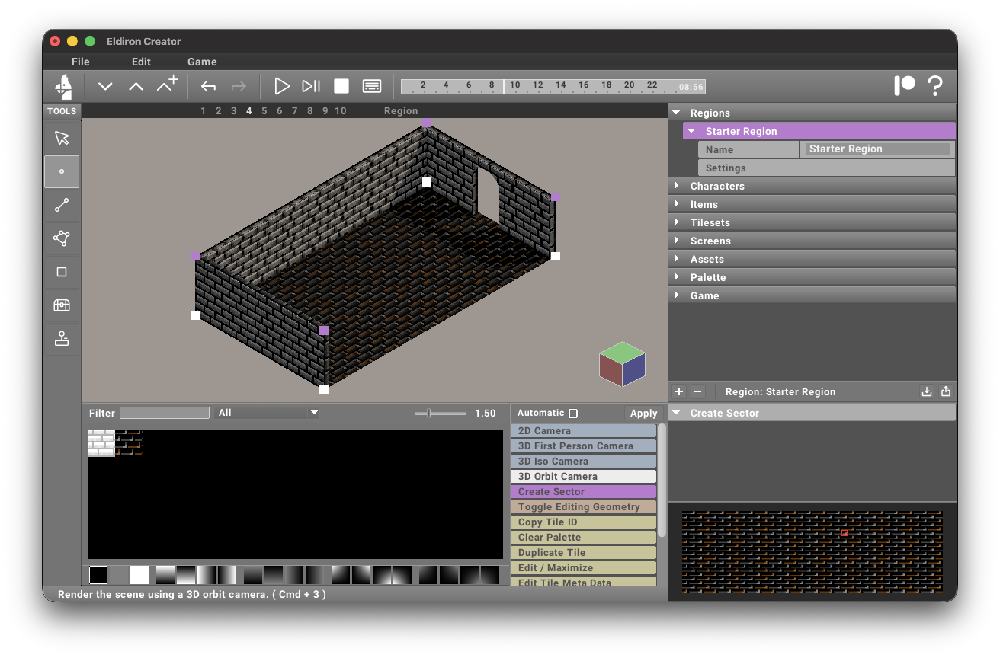

which will create a new surface sector. After extrusion and applying a tile the roof will look like this.

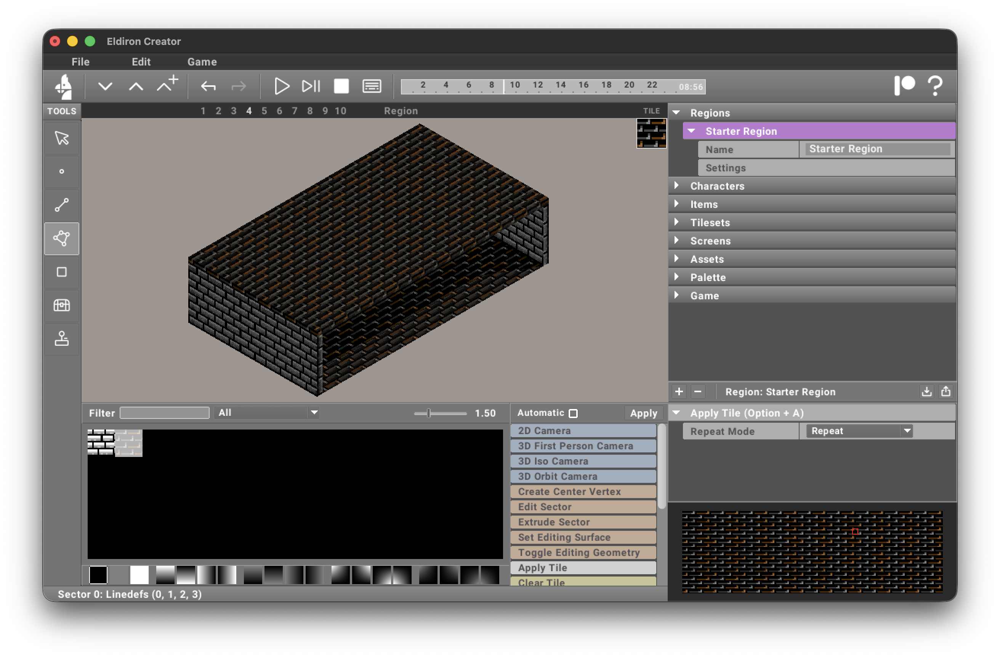

### Gable Roof

For a gable roof we need to create new vertices. Undo the flat roof creation and select the two linedefs of the upper side walls like this:

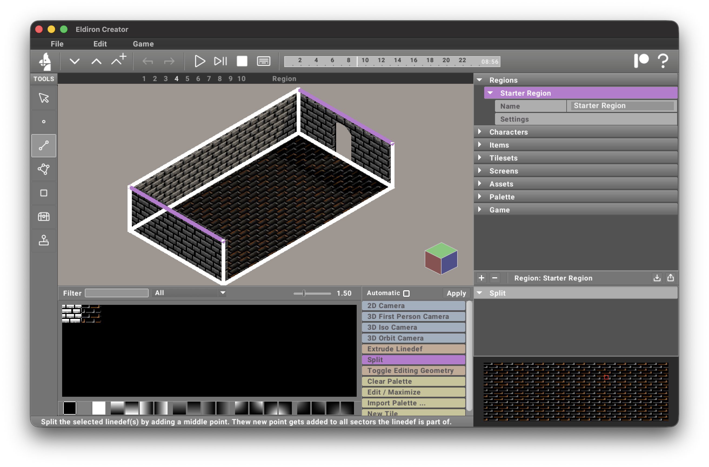

Applying the [Split](/docs/creator/actions/#split) action on the two linedefs will split them in two, i.e. create a new vertex in the middle of each of them.

Now we can select each vertex with the **vertex tool**, which automatically selects the [Edit Vertex](/docs/creator/actions/#edit-vertex) action. Here we change the **Y** coordinate of the vertex from 2 to 4, moving it up.

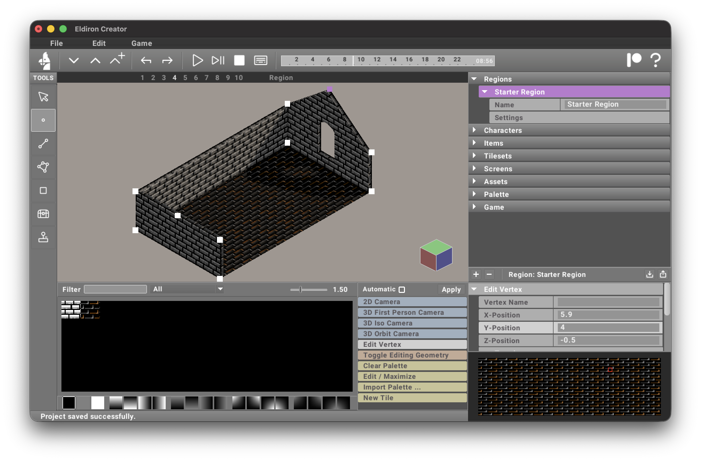

Selecting the four vertices and applying the [Create Sector](/docs/creator/actions/#create-sector) action again will create one half of the gable roof.

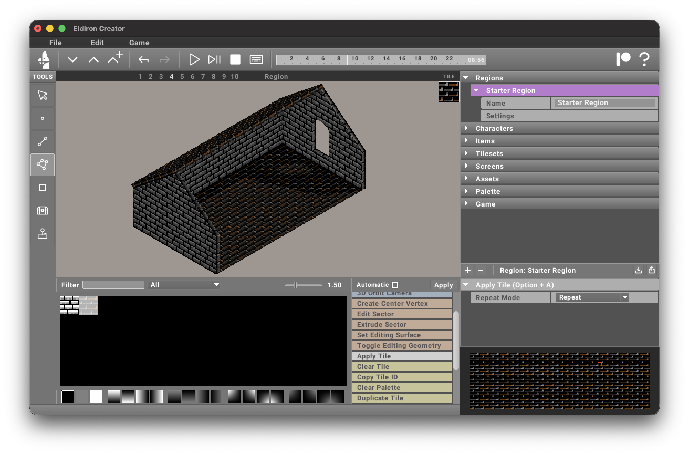

<Admonition type="note" title="Create Sector">
    The **Create Sector** action works with both vertices and linedefs. Use it to create custom surface sectors for your geometry.
</Admonition>

Of course you can further decorate roof surfaces or floors with profiles (recesses / reliefs) like we did with the side wall.

<Admonition type="tip" title="Creating Vertices">
    Shift-clicking geometry with the **vertex** tool creates a new vertex at the hit position—handy for quickly adding and connecting vertices.
</Admonition>
