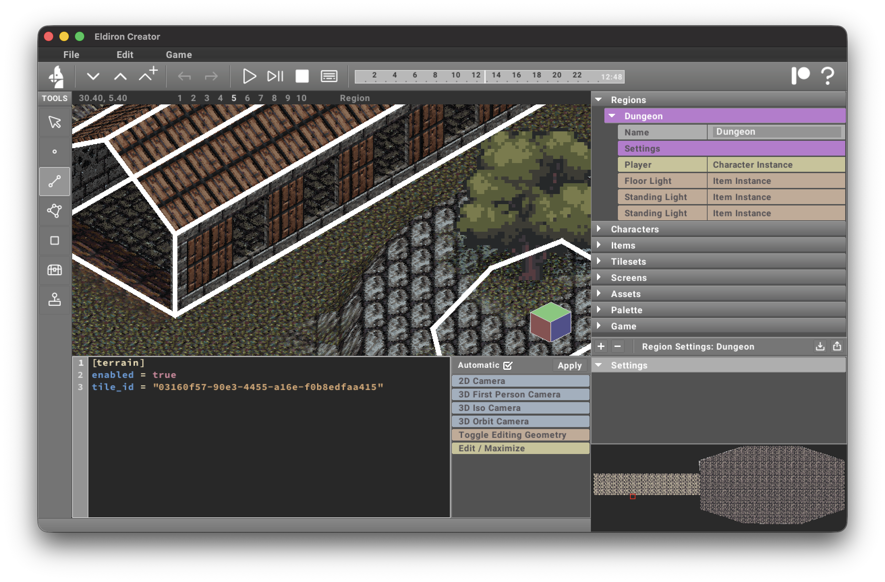
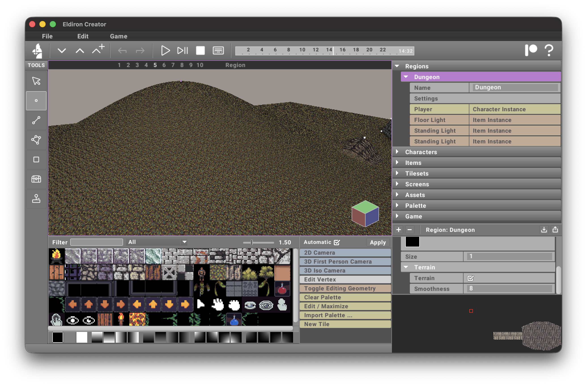

import Admonition from '@theme/Admonition';

<Admonition type="note" title="Work in Progress">
    The terrain system is still a work in progress.
</Admonition>

Enable terrain for a region map in *Region Settings*. Terrain is only rendered in 3D camera modes.

In the settings you can define a [tile id](../what_is/#tile-id) for the default tile of the terrain.

You can draw tiles on the terrain with the [Rect](../tools/rect) tool, just as you would on any other surface.

By default the terrain is rendered as a flat surface. You can add surface detail using **vertices**, **linedefs**, and **sectors**.

## Creating surface details

### Vertices

Placing a **vertex** on the map and enabling its **Terrain** parameter makes that vertex a terrain control point. Vertices with y-values greater than zero create hills; negative values create valleys.

The **Smoothness** parameter controls how far this control point influences the terrain: higher values create broader, smoother features; lower values create tighter, localized features.

<Admonition type="note" title="Non-Destructive Terrain Workflow">
    As you move terrain-controlling geometry on the map, the terrain regenerates automatically, keeping the workflow non-destructive.
</Admonition>

### Sectors

Sectors have currently three possible *Terrain Roles*:

* **None**. The sector does not influence the terrain (the default).
* **Exclude**. Creates a hole in the terrain. Used for example for houses, selecting the ground floor sector of the house and enabling this terrain mode will cut a hole into the terrain for the house. Otherwise terrain geometry could be visible inside the house.
* **Ridge**. Creates a ridge like in the screenshot below. You can define the *height*, the size of the *plateau*, and the steepness of the **falloff**.

### Linedefs

Linedefs will cut roads through the terrain. (To be implemented.)
