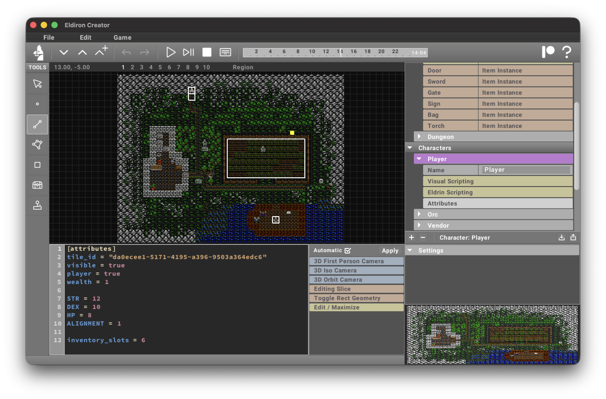

The attribute editor is active when the *Attributes* item is selected for **Characters** and **Items**, where allows you to edit the [Attributes](/docs/characters_items/attributes) of characters and items.

It is also used for various settings, like the [Game](/docs/configuration/game) settings.
