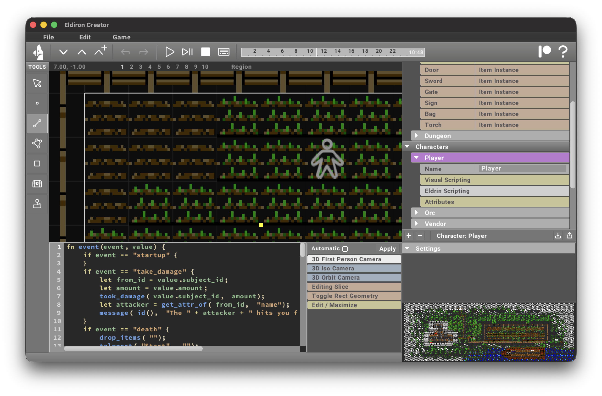

The eldrin script editor is active when the *Eldrin Scripting* item is selected for **Characters** and **Items**.

It allows you to directly edit in the [Eldrin Scripting Language](/docs/characters_items/eldrin_scripting_language).
