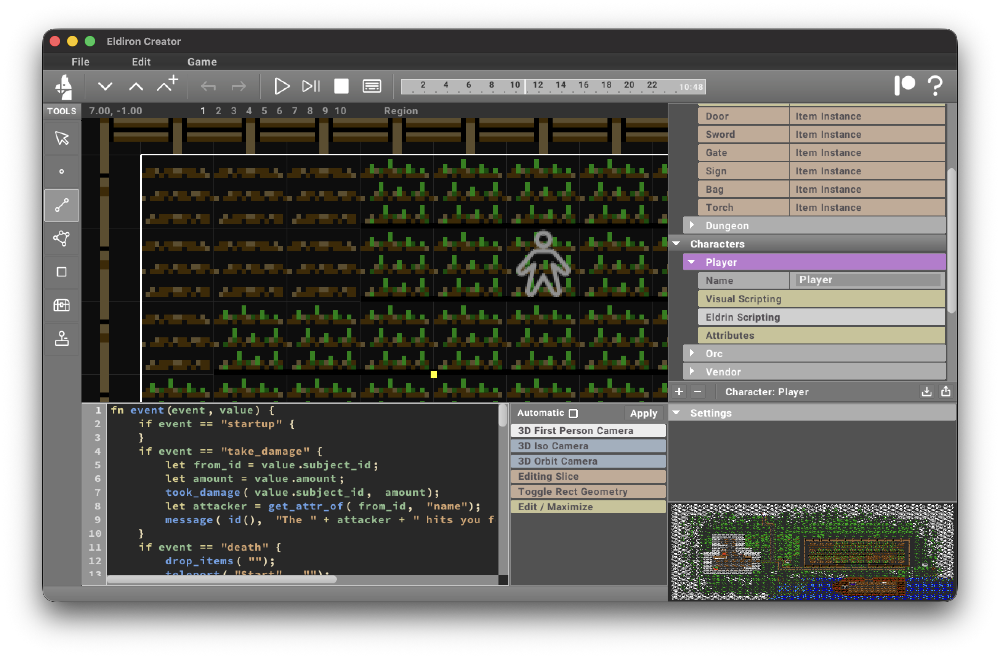

The Eldrin script editor is active when an *Eldrin Scripting* item is selected for a world, region, character, or item.

It allows you to directly edit in the [Eldrin Scripting Language](/docs/characters_items/eldrin_scripting_language).

This editor writes gameplay scripts for the selected project object. Creator automation functions such as `editor_action` and `editor_tool` belong to Scepter's separate editor-automation host; typing them into an ordinary world, region, character, or item script does not make them available there. See [Scepter: Remote Editing](/docs/creator/scepter_remote_editing#creator-actions-and-tools).
