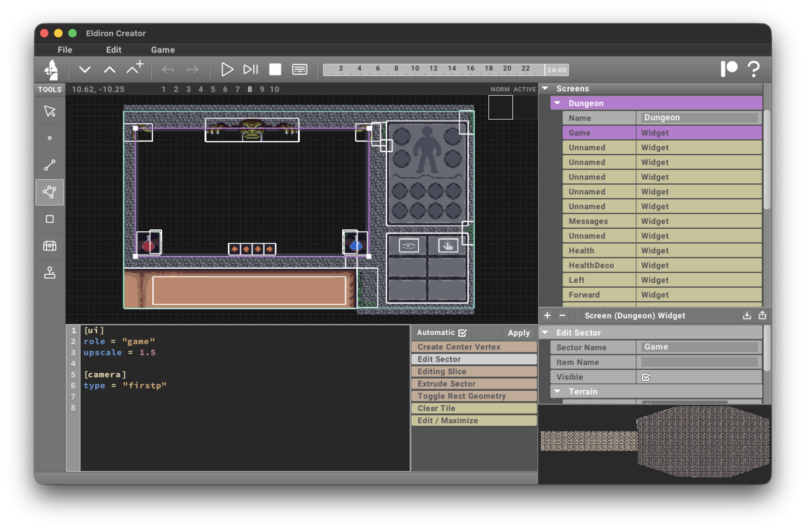

**Screens** are special maps that define the **visible area** of your game, i.e. your game UI.

Design screens with the same map tools you already use:

- **Linedef Tool** and **Sector Tool**: carve areas, name sectors to turn them into widgets.
- **Rect Tool**: add background decorations.

Each **sector** shows up as an item in the project tree; selecting it opens the widget editor where you can set the **role** and configure widget **attributes** (see [widgets](widgets)).
