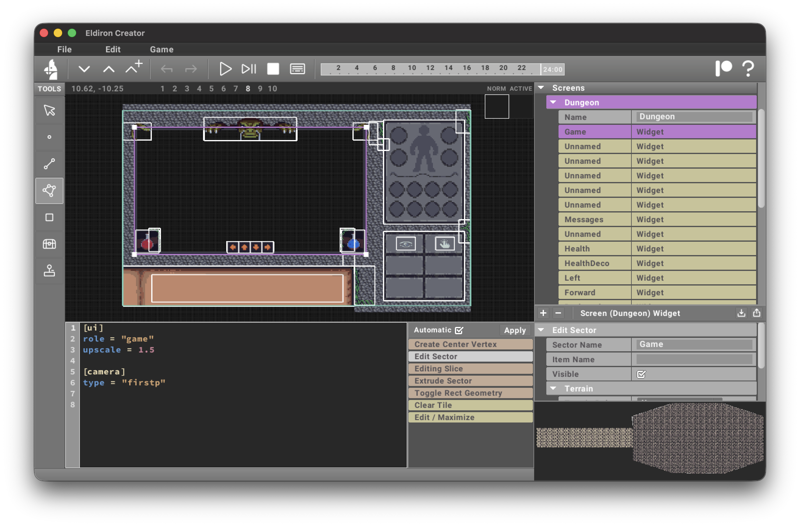

**Screens** are special maps that define the **visible area** of your game, i.e. your game UI.

Design screens with the same map tools you already use:

- **Linedef / Edge Tool** and **Sector / Face Tool**: carve areas, name sectors to turn them into widgets.
- **Rect Tool**: add background decorations.



Each **sector** shows up as an item in the project tree; selecting it opens the widget editor where you can set the **role** and configure widget **attributes** (see [widgets](widgets)).

## Eldiron Source Screens

Eldiron Source projects can define the same screen widgets in `.els` files.
The source form compiles into the normal Eldiron screen data, so Creator and all
clients use the same widget roles and configuration.

```text
Screen "play" {
  name = "Dungeon Play"

  widget "Game" {
    role = "game"
    x = 0
    y = 96
    width = 720
    height = 504

    data {
      [ui]
      role = "game"
      grid_size = 40

      [camera]
      type = "firstp"
    }
  }

  widget "Leader Profile" {
    role = "profile"
    x = 8
    y = 8
    width = 222
    height = 80

    data {
      [ui]
      role = "profile"
      party = "leader"
      image_size = 64
      stats_layout = "side"

      [[ui.stats]]
      stat = "HP"
      max_stat = "MAX_HP"
      height = 14
      fill_color = "#d63a3a"
      background_color = "#250909"
      border_color = "#6c3030"
      border_size = 1
    }
  }
}
```

- **Screen** defines one screen map.
- **widget** defines a rectangular widget by name, role, position, and size.
- **data** contains the same TOML widget configuration used by Creator widgets.
- Coordinates and sizes are screen pixels. Match them to the project
  `[viewport]` dimensions in `eldiron.toml`.
