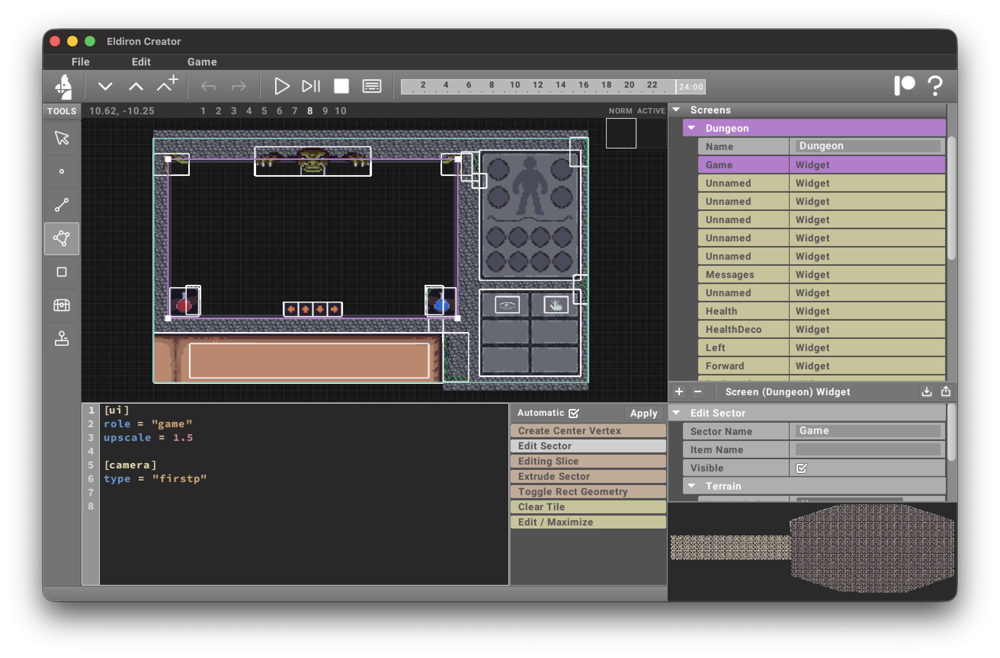

**Screens** are special maps that define the **visible area** of your game, i.e. your game UI.

Design screens with the same map tools you already use:

- **Linedef / Edge Tool** and **Sector / Face Tool**: carve areas, name sectors to turn them into widgets.
- **Rect Tool**: add background decorations.



Each **sector** shows up as an item in the project tree; selecting it opens the widget editor where you can set the **role** and configure widget **attributes** (see [widgets](widgets)).

## Screen Settings and Responsive Layout

Select **Settings** below a Screen in the project tree to edit its screen-level TOML. Screens use the legacy fixed canvas unless they explicitly enable responsive layout:

```toml
[layout]
mode = "responsive"
```

On a responsive screen, an existing `role = "game"` widget automatically fills the current client window. Widget roles are lowercase identifiers, so use `role = "game"`, not `role = "Game"`. Eldiron does not create a game widget automatically: a responsive screen without one is a valid UI-only screen.

For a ruleset-driven bottom UI, add one widget with `role = "action_bar"` and anchor it with `anchor = "bottom_center"`. The widget generates its configured buttons as a group and keeps the complete bar centered when the window is resized. Its TOML can also configure built-in panels such as `[ui.equipment]`, `[ui.inventory]`, `[ui.spellbook]`, and `[ui.preferences]`, so an ordinary gameplay screen does not need separate popup widgets. Add a `role = "equipment"`, `role = "inventory"`, or `role = "spellbook"` sector only when that screen should override the corresponding default panel rectangle or presentation. See [Action Bar Widgets](./widgets#action-bar-widgets).

Reusable `role = "tab_bar"` and `role = "dropdown"` widgets provide binding-driven selections for inventory filters, sorting, and custom panels. They use Eldiron's embedded Roboto Bold font by default and can select a project font explicitly. See [Tab Bar and Dropdown Widgets](./widgets#tab-bar-and-dropdown-widgets).

Other widgets can anchor their authored size to the runtime window:

```toml
[layout]
anchor = "bottom_center"
x = 0
y = -20
```

Supported anchors are `top_left`, `top_center`, `top_right`, `center_left`, `center`, `center_right`, `bottom_left`, `bottom_center`, and `bottom_right`. The optional `x` and `y` values are offsets from the anchor. Without an anchor, the authored widget rectangle is retained.
