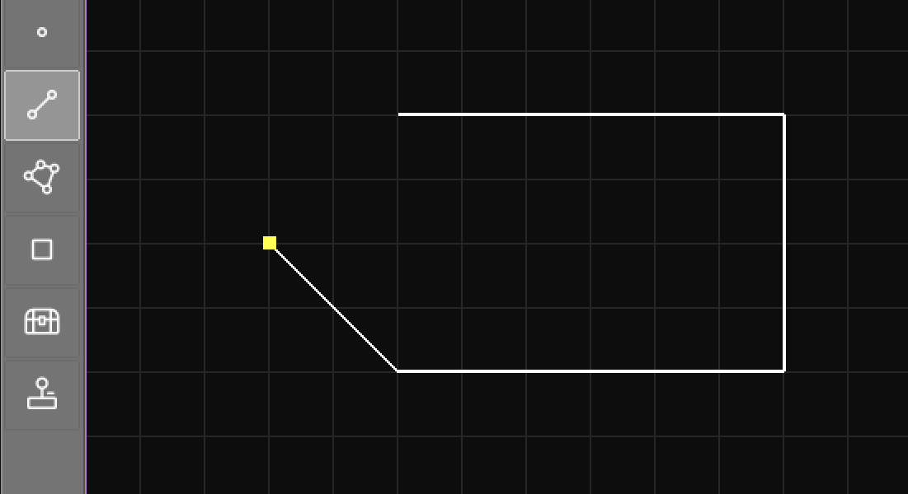
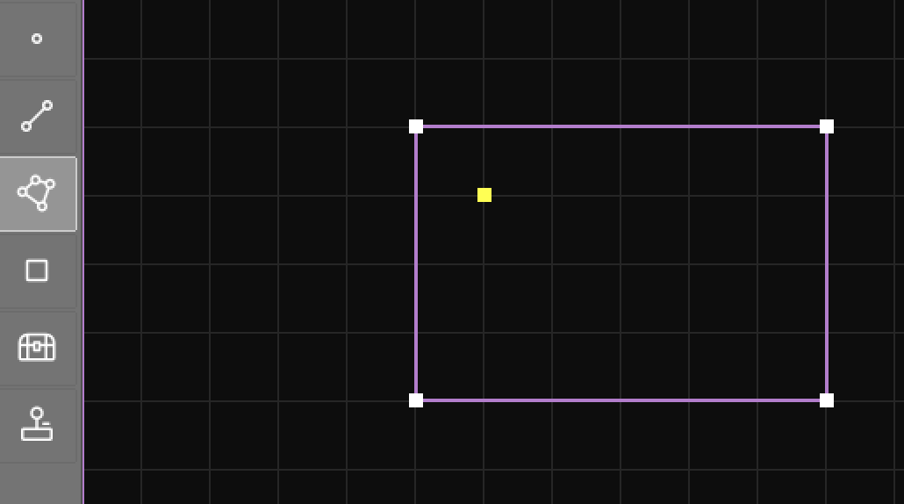
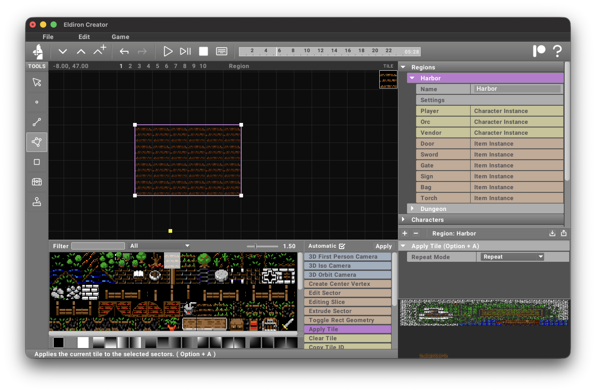

import Admonition from '@theme/Admonition';

Creating geometry is crucial for both 2D and 3D maps. We have 3 different types of geometry in Eldiron:

- **Vertices** are points in the map.
- **Linedefs** are lines between the points.
- **Sectors** are a series of *linedefs* which form a closed polygon.

<Admonition type="tip" title="Doom">
The terms **Linedefs** and **Sectors** are based on the game Doom, which used the same terminology. 
</Admonition>

You can apply tiles **only** to sectors (for example via the [Apply Tile](creator/actions/#apply-tile) action or by using the [Rect](creator/tools/rect) tool).

## Creating Sectors

To create a sector we use the [Linedef](creator/tools/linedef) tool.

When you click on grid positions, the [Linedef](creator/tools/linedef) tool automatically creates new vertices and linedefs between those points. Clicking the starting vertex again closes the polygon.

Here we selected the [Sector](creator/tools/sector) tool to select the newly created sector.

By default the [linedef](creator/tools/linedef) tool is in *manual* mode, meaning you have to click every vertex position to create a **sector**, even if some of the **vertices** already exist.

<Admonition type="tip" title="Auto Mode">
When you hold **Cmd/Ctrl** while clicking the tool tries to auto-close existing polygons on every click, so you just need to click on the **vertices** you want to connect to close a polygon.
</Admonition>

## Applying a Tile

Now we can apply a tile to the sector using the [Apply Tile](creator/actions/#apply-tile) action which applies the currently selected tile in the tile-picker to the currently selected **sector**.

The [Rect](creator/tools/rect) tool does all the above in one step, it creates a rectangular sector and applies the currently selected tile to it, but it is only used for decoration purposes (i.e. quickly drawing tiles). When you want to create the foundations of an area (for example a house), you need to create its **sector** manually.

## Other Functions

The [Vertex](creator/tools/vertex), [Linedef](creator/tools/linedef) and [Sector](creator/tools/sector) tools have a diverse set of functionality, so make sure to read their documentation. You can, for example, create new standalone **vertices** with the **vertex** tool by holding *Shift* and clicking in the grid.

Using each tool you can select and drag the corresponding geometry, both in 2D and 3D. In 3D camera views you have a small gizmo helper at the bottom right of the viewport to control in which plane you are dragging the geometry:

Press **Delete** to remove the currently selected geometry.

All geometry editing operations are undoable.
