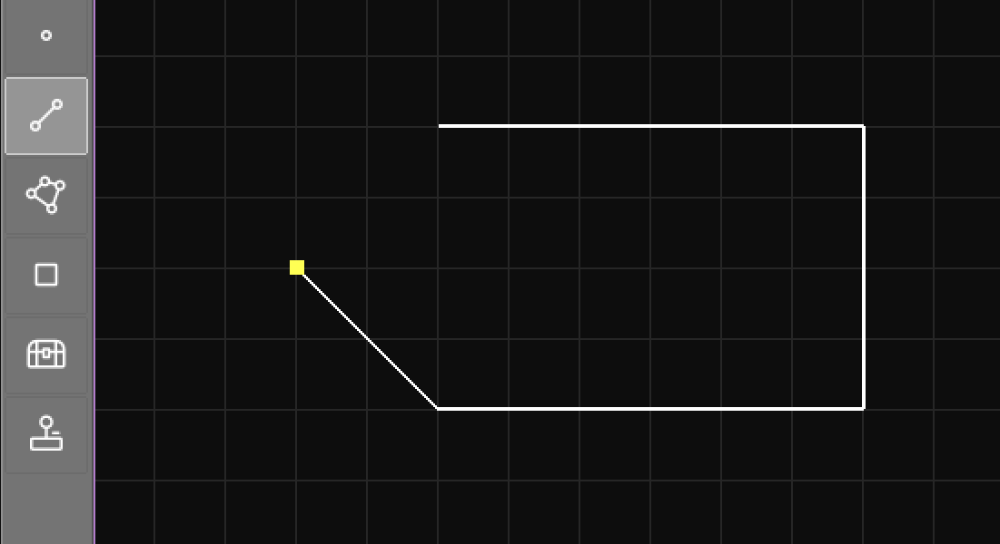
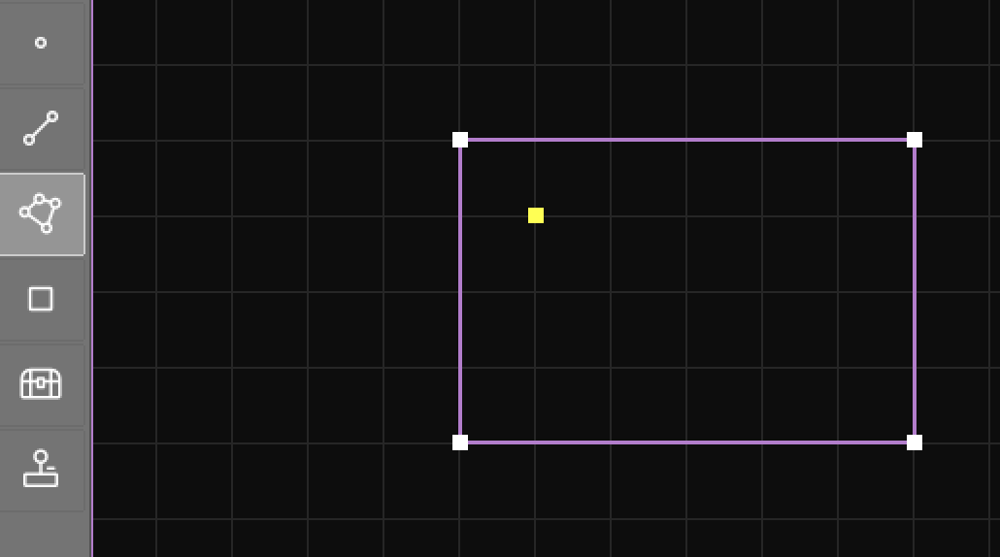
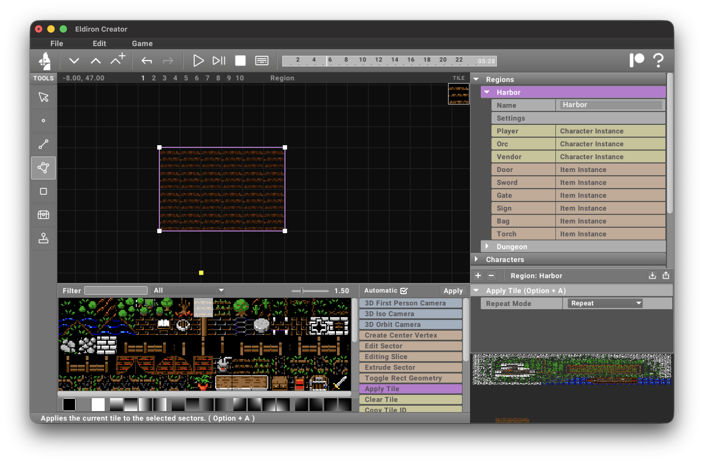

import Admonition from '@theme/Admonition';

Creating geometry is crucial for both 2D and 3D maps. We have 3 different types of geometry in Eldiron:

- **Vertices** are points in the map.
- **Linedefs** are lines between the points.
- **Sectors** are a series of *linedefs* which form a closed polygon.

<Admonition type="tip" title="Doom">
The terms **Linedefs** and **Sectors** are based on the game Doom, which used the same terminology. 
</Admonition>

You can apply tiles **only** to sectors, for example via the **Apply Tile** button in the **Tile Picker** dock or by using the [Rect](creator/tools/rect) tool.

## Creating Sectors

To create a sector we use the [Linedef](creator/tools/linedef) tool.

When you click on grid positions, the [Linedef](creator/tools/linedef) tool automatically creates new vertices and linedefs between those points. Clicking the starting vertex again closes the polygon.

Here we selected the [Sector](creator/tools/sector) tool to select the newly created sector.

By default the [linedef](creator/tools/linedef) tool is in *manual* mode, meaning you have to click every vertex position to create a **sector**, even if some of the **vertices** already exist.

<Admonition type="tip" title="Auto Mode">
When you hold **Cmd/Ctrl** while clicking the tool tries to auto-close existing polygons on every click, so you just need to click on the **vertices** you want to connect to close a polygon.
</Admonition>

## Applying a Tile

Now we can apply a tile to the sector using the **Apply Tile** button in the **Tile Picker** dock. It applies the currently selected tile in the tile picker to the currently selected **sector**.

The [Rect](creator/tools/rect) tool does all the above in one step, it creates a rectangular sector and applies the currently selected tile to it, but it is only used for decoration purposes (i.e. quickly drawing tiles). When you want to create the foundations of an area (for example a house), you need to create its **sector** manually.

## Other Functions

The [Vertex](creator/tools/vertex), [Linedef](creator/tools/linedef) and [Sector](creator/tools/sector) tools have a diverse set of functionality, so make sure to read their documentation. You can, for example, create new standalone **vertices** with the **vertex** tool by holding *Shift* and clicking in the grid.

## 3D Geometry Modes

In 3D views, Eldiron uses direct **Geometry Object** editing.

The same tool names are reused, but they operate on the selected 3D object:

- The **Object Tool** selects and transforms whole objects.
- The **Vertex Tool** selects and edits object vertices.
- The **Linedef Tool** selects and edits object edges.
- The **Sector / Face Tool** selects and edits object faces.

This keeps the 2D editor vocabulary intact while giving the 3D path direct object, face, edge, and vertex editing.

The 3D editor works with Geometry Objects. Existing 2D linedefs are shown as a faint floor-plane reference overlay, and the 2D map data can still be used for gameplay zones, triggers, and minimaps.

Press **Delete** to remove the currently selected geometry.

All geometry editing operations are undoable.
