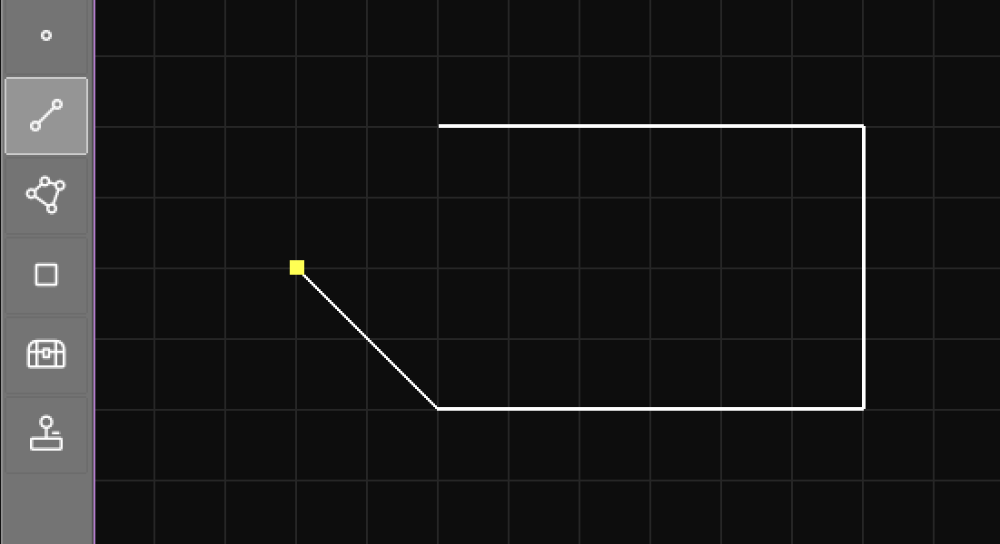
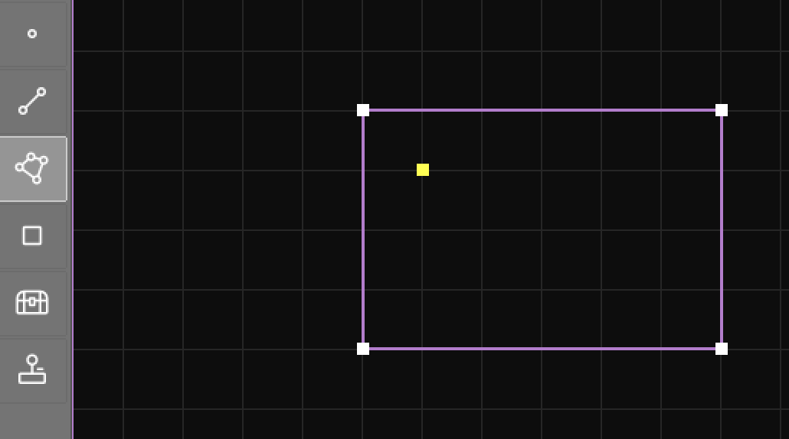
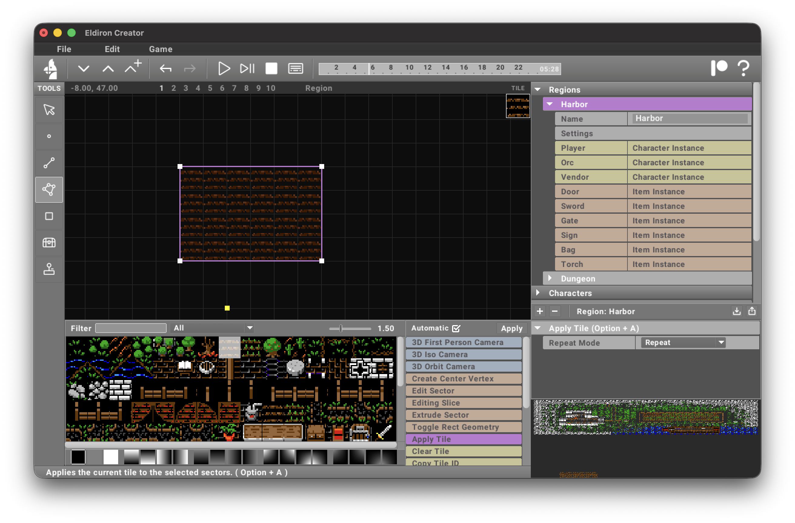

import Admonition from '@theme/Admonition';

Creating geometry is crucial for both 2D and 3D maps. We have 3 different types of geometry in Eldiron:

- **Vertices** are points in the map.
- **Linedefs** are lines between the points.
- **Sectors** are a series of *linedefs* which form a closed polygon.

<Admonition type="tip" title="Doom">
The terms **Linedefs** and **Sectors** are based on the game Doom, which used the same terminology. 
</Admonition>

You can apply tiles **only** to sectors, for example via the **Apply Tile** button in the **Tile Picker** dock or by using the [Rect](creator/tools/rect) tool.

## Creating Sectors

To create a sector we use the [Linedef](creator/tools/linedef) tool.

When you click on grid positions, the [Linedef](creator/tools/linedef) tool automatically creates new vertices and linedefs between those points. Clicking the starting vertex again closes the polygon.

Here we selected the [Sector](creator/tools/sector) tool to select the newly created sector.

By default the [linedef](creator/tools/linedef) tool is in *manual* mode, meaning you have to click every vertex position to create a **sector**, even if some of the **vertices** already exist.

<Admonition type="tip" title="Auto Mode">
When you hold **Cmd/Ctrl** while clicking the tool tries to auto-close existing polygons on every click, so you just need to click on the **vertices** you want to connect to close a polygon.
</Admonition>

## Applying a Tile

Now we can apply a tile to the sector using the **Apply Tile** button in the **Tile Picker** dock. It applies the currently selected tile in the tile picker to the currently selected **sector**.

The [Rect](creator/tools/rect) tool does all the above in one step, it creates a rectangular sector and applies the currently selected tile to it, but it is only used for decoration purposes (i.e. quickly drawing tiles). When you want to create the foundations of an area (for example a house), you need to create its **sector** manually.

## Other Functions

The [Vertex](creator/tools/vertex), [Linedef](creator/tools/linedef) and [Sector](creator/tools/sector) tools have a diverse set of functionality, so make sure to read their documentation. You can, for example, create new standalone **vertices** with the **vertex** tool by holding *Shift* and clicking in the grid.

## 3D Geometry Modes

In 3D views, Eldiron uses direct **Geometry Object** editing.

The same tool names are reused, but they operate on the selected 3D object:

- The **Object Tool** selects and transforms whole objects.
- The **Vertex Tool** selects and edits object vertices.
- The **Linedef / Edge Tool** selects and edits object edges, and draws surface lines on selected faces.
- The **Sector / Face Tool** selects and edits object faces.

This keeps the 2D editor vocabulary intact while giving the 3D path direct object, face, edge, and vertex editing.

The 3D editor works with Geometry Objects. Existing 2D linedefs are shown as a faint floor-plane reference overlay, and the 2D map data can still be used for gameplay zones, triggers, and minimaps.

Surface lines are the 3D path for drawn detail. Draw them on a selected face with the **Linedef / Edge Tool**, then use actions such as **Create Ridge**, **Create Groove**, or **Create Cutout** to turn those lines into persistent geometry or through-object openings.

Press **Delete** to remove the currently selected geometry.

All geometry editing operations are undoable.

## Construction patterns

The **Wall Tool** creates and selects walls, floors, and ceilings. Its panel switches between
Build, Select, Opening, Brick, and Surface modes. In Surface mode, choose Floor or Ceiling and
click inside a closed wall loop to fill it, or Shift-drag a rectangle anywhere to create an
independent surface. Floor and ceiling visibility can be toggled in the editor without changing
game visibility. Choose **Floor** or **Ceiling**, then **Fill All** to detect enclosed areas,
including short aligned doorway gaps, and highlight their outlines. Review the outlines, then
click **Create All** to create only that surface type, or press Esc to cancel. Newly created surfaces
receive an editable Surface branch with subdivision and material nodes. Matching surfaces created
in one bulk operation share the branch; different ceiling heights retain separate branches. New surfaces use a gray
**Noise → Gradient** material by default. Choose **Value** or **Voronoi** on Noise and adjust scale
and seed. Connect its Value output to Gradient’s left input; Gradient maps the field between its two color parameters (choose each from the artist palette) and sends Material from its right output to the surface or pattern. Noise tiles repeat
seamlessly and are generated into the texture atlas. Bulk ceilings use the tallest boundary wall;
adjoining ceilings at different heights generate vertical closures along their shared edges.
Shorter boundary walls also receive closures up to the ceiling, so varying wall heights leave no gaps.
Existing surfaces retain their authored elevations; adjust their Surface branch or recreate them
to use the new inferred height. **Hide Ceilings** clears the editing view without removing them.

The Construction dock uses the same branch workflow as Behavior Nodes: branches appear to the
left of the graph, and available nodes appear in the sidebar's Node List. Drag a Wall, Surface,
or Pattern root from Node List into the graph to create a branch. Click a branch to edit it;
use **Assign to Selection** to link a Wall or Surface branch to the selected geometry. The filled dot marks
the assigned branch. Branches are project-wide and can be shared by multiple walls or surfaces.
Floor and ceiling use the same Surface branch type.
The Construction toolbar's **Tidy Graph** button lays out the selected branch left to right;
adding, removing, or reconnecting nodes tidies it automatically. Moving a node manually does not.
The **Fill** slider beside the editor camera buttons brightens the 3D editing preview without
changing the game's lighting.

Surface graphs use **Surface**, **Inset**, **Subdivide**, **Pattern Reference**, **Color**, **Tile**, and **Surface Output**.
Connect geometry terminals to the geometry input, and material terminals to the output's
**Top** or **Sides** input. Different terminal types cannot be connected. The Inset value controls
the gap around the area; Subdivide adds a shallow repeating quad pattern to rectangular areas.
The Surface node controls elevation and thickness, and the output controls material repeats.
Click a Color or Tile field to choose visually from the project's palette or authored tiles.
When a Wall or Surface branch is assigned, its graph owns the material slots marked **N** in
the top material strip. Edit those materials in the branch. Opening surrounds and the older
assembly floor slot remain independent material overrides.
To use a shared Pattern on a floor or ceiling, put **Pattern Reference** in the geometry chain
between Surface and Surface Output, then choose a Pattern branch. Its block width and height
become the two surface subdivision axes; its stone and mortar materials become the top and grout.
An explicit Color or Tile connection to Surface Output's Top or Sides input overrides the shared
material for that face. Disconnect the default Top color connection to see the Pattern's material.
Wall branches run left to right: **Wall** sets basic dimensions, its **Build** output connects
to a **Pattern Reference**, and that connects to **Wall Output**. A reusable Pattern branch runs
**Pattern → Masonry → Wall Finish → Pattern Output**. Color and Tile nodes feed the Stone,
Mortar, and Frame material inputs. Rearrange, replace, or bypass the middle geometry nodes to
change what the branch builds. The reference selects a shared Pattern branch; editing it updates
every wall that uses it. This is the initial modular node set, with room for more geometry and
material operations. Insert **Pattern Scale** into the Build chain to multiply block width and
height. Connect several Color or Tile nodes to Masonry's Stone input to vary the stones; the
**Stone Variation** setting in Wall Finish controls how often alternate materials appear. The same Pattern branch
can be used by Wall and Surface branches, so edits to it refresh both. The present renderer supports
block subdivision and material variation on rectangular surfaces; further geometry operations will
need corresponding renderer support.

For Stonefall, open the Wall Tool, choose **SURF** → **Floor**, and click **Fill All**. Check the highlighted
areas before clicking **Create All**. Repeat with **Ceiling** selected to add ceilings. The detection gaps are temporary; it does not add wall spans.
Click a created surface to select it and assign a shared Surface branch in the Construction dock.
Use **Hide Ceilings** while editing below them; this affects only the editor preview. Individual
surfaces can still be added with a click or Shift-drag.
Geometry retains its last valid appearance while a pattern graph is incomplete.

Branches are arranged on their first opening. After that, node and connection edits preserve your
layout. Use **Tidy Graph** to arrange them again explicitly. Newly created construction graphs
start with a left-to-right layout.
