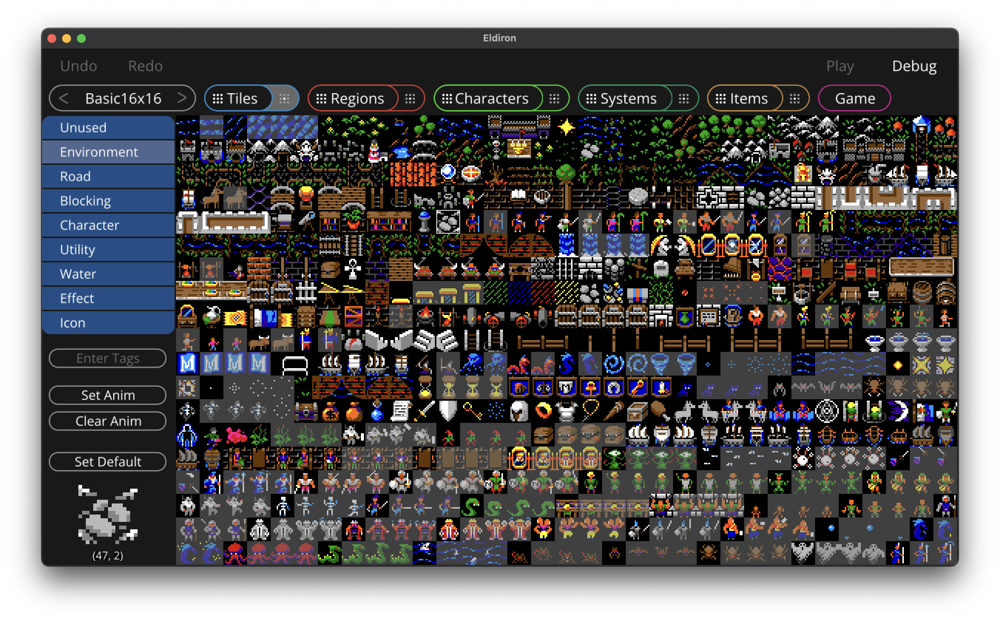
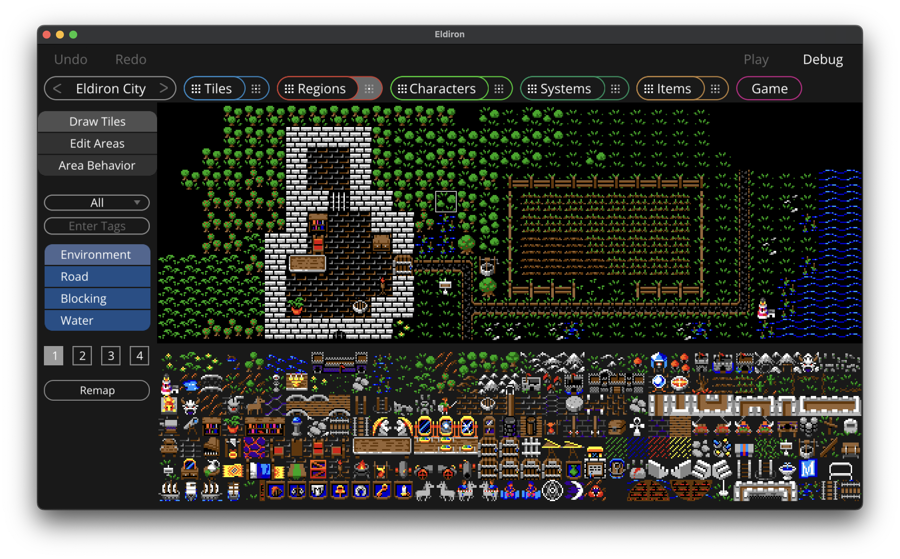
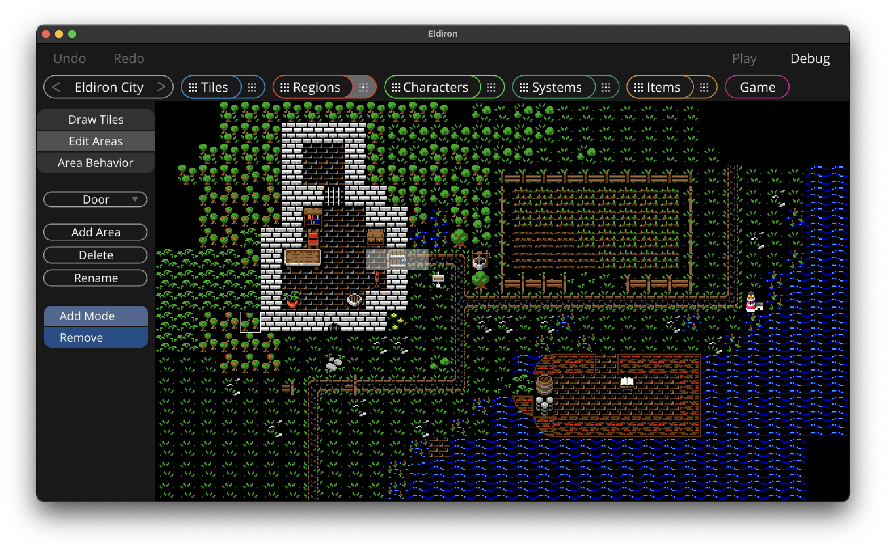
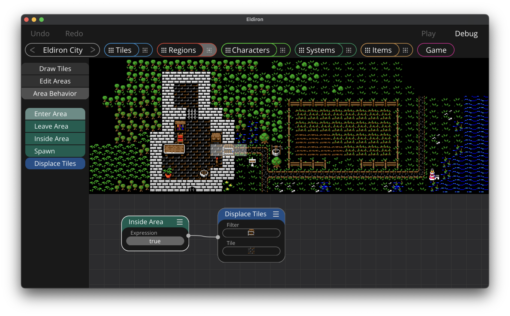
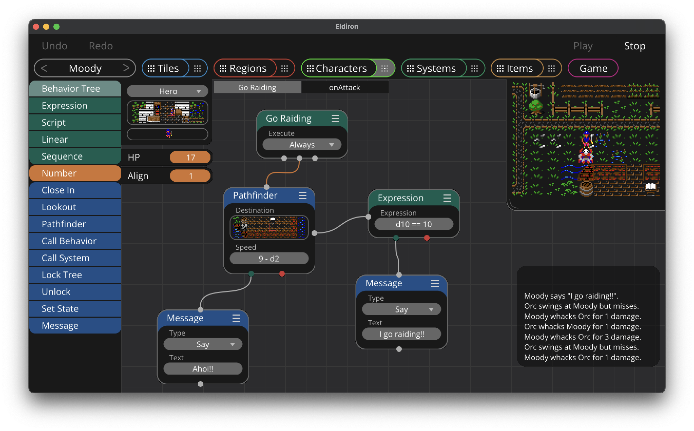
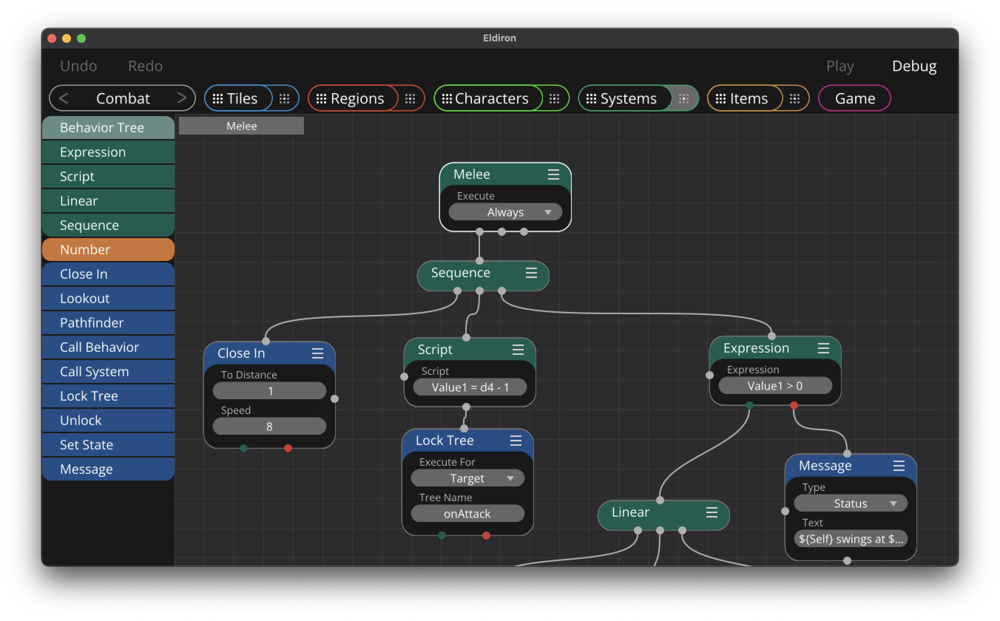

  

<!---
 -->

Create RPGs for every platform with Eldiron.

 Eldiron v1 will be able to create games similar to the classic Ultima series but with modern features.

Eldiron is a cross platform RPG engine. Eldiron Creator itself runs on all Desktops (Mac, Windows and Linux) while the game clients also run on iOS and Android devices and on any other device Rust compiles on. The engine is designed from the ground up to be extremely portable.

Eldiron comes with a range of freely usable tilemaps, however you can of course use your own tilemaps, see the instructions below. Note that only square tiles are supported.

The game engine contains client and server modules, although currently no multi-player options exist yet, the code has been written with multi-player support in mind from the ground up.

Support for retro 3D areas like dungeons is upcoming. In general I want to explore many different ways to display and create content, from procedurally created tiles to 3D assets. These kind of features will get implemented over time.

Join the community on [Discord](https://discord.gg/ZrNj6baSZU).

Below on this page is an overview of the functionality of Eldiron. However I am creating a full set of documentation in the [Wiki](https://github.com/markusmoenig/Eldiron/wiki). Please refer to the Wiki for more detailed information, the Wiki will grow over time as more functionality is added.

<!---
I also try to maintain a development blog on [YouTube](https://www.youtube.com/channel/UCCmrO356zLQv_m8dPEqBUfA).
-->

## Updates

#### Eldiron v0.5, 28th April '22

Newly added features:

* Completely reworked Regions view, now has 3 modes for drawing tiles, editing area and assigning behavior nodes to areas.
* Regions now support transparency and up to 4 layers of tiles.
* Working Systems, every character can now call system behavior trees for common functionality (combat, crafting etc).

#### Eldiron v0.3, 12th April '22

Newly added features:

* Named behavior trees can be selected via the tab bar at the top of the node graph.
* New *Lookout* and *Close In* nodes.
* *Expression* and *Script* nodes now have a full scripting system behind them.
* New Systems editor where soon the user can create systems for Combat, Magic, Crafting and so on. Systems will allow the implementation of basic mechanics every character can utilize.

## Installation

Eldiron is written in Rust, to run it you have to install Rust and its package manager cargo. Please follow the instructions on this [page](https://www.rust-lang.org/tools/install).

After you successfully installed Rust, clone this repository (or download the source via a .zip file), open a terminal, navigate to the Eldiron directory and start Eldiron with `cargo run --release`.

At a later stage I will provide pre-build binaries for each platform.

## Tiles View (95% Done)

In the Tiles view you can assign roles and animations to individual tiles in the currently available tilemaps.

Eldiron reads all assets from the assets directory, this is a top level directory in this repository. If you want to add your own tilemaps to Eldiron you will need to paste the tilemap image into the assets/tilemaps directory. Note that right now only tilemaps with square tiles are supported.

You can multi-select a range of tiles (via mouse click and drag) and by clicking the *Set Anim* button you create an animation for the first tile in the range. The other tiles will be set to *Unused* by default.

When you click the *Enter Tags* button you can assign **,** separated tags to a tile, like *cupboard* or *waterfall*. Tags are always lower case.

The *Clear Anim* button will remove an animation sequence form the currently selected tile.

The *Set Default* button will set the currently selected tile as the default tile of the tilemap, it will be shown as a tilemap icon in the tilemap overview.

The roles a tile can have are:

* **Unused** - This tile is ignored and will not be shown in the area editor.
* **Environment** - This is the default tile type for any kind of non blocking terrain. Use it for grass, floors etc.
* **Road** - Same as Environment but the AI in the upcoming Pathfinder node will prefer road tiles over environment tiles.
* **Blocking** - Every environment tile which is not accessible to the player, like rocks, mountains, walls etc.
* **Character** - Character tiles, like animation tiles for a warrior.
* **Utility** - Utility character tiles. Like a ship or a horse.
* **Water** - Water tiles. Tiles where a ship can go.
* **Effect** - Effect tiles, like an explosion.
* **Icon** - Icons.

Note that the behavior and look for tiles in a certain area or for a given tile in general can be freely adjusted via the Behavior node system.

## The Regions View (70% Done)

Regions are game regions (like a city, dungeon or the world itself) or screen space regions (like a specific UI area).

The regions view has 3 different modes.

### Drawing Tiles

At the bottom of the view you can select the tiles of the selected tilemap (or tilemaps). You will see all tiles you marked as *Environment*, *Road*, *Blocking* or *Water*.

You can view all tiles of all tilemaps or select a specific tilemap. Also you can enter tags to only show tiles containing this specific tag. Useful for quickly finding tiles.

Select a tile and click and drag in the region to apply the tile to the area map.

While the basic functionality of the area editor is working, some functions are missing:

* Undo / Redo
* Rectangular operations (cut / copy / paste / move / copy) etc.
* Assigning tiles to groups

### Editing Areas

Areas are a named group of tiles inside a region. They are useful to mark specific game areas of interest (like a house of a character you want to mark or use in the Pathfinder node) or maybe you want to spawn monsters in the area, lay a trap or displace tiles.

You can add, delete or rename areas. In *Add Mode* new tiles are added to the area while in *Remove* mode tiles are removed from the area.

### Area Behavior

You can assign behavior to a specific area in the view. For example in the above screenshot, if any character is inside the area around the door, the door icon is replaced with a floor icon to simulate an opening door.

## Characters View (80% Done)

In this view you are able to create any kind of behavior for characters.

## Systems View (80% Done)

The Systems view is similar to the *Characters* view. It's main function is to be able to create reusable behavior trees which can be invoked from any character. Like in the above screenshot is a basic implementation for a *Combat* system with a *Melee* tree. You would not want to create a combat system for every character, but a general one which uses the variables of the character to calculate damage dealt and received. You can of course still write customized individual AI for specific characters.

But apart from Combat you can of course also implement other Systsems, like crafting or farming.

## Items View (0% Done)

A specialized node view for in game items and their stats, modifiers and special effects.

## Game View (0% Done)

A specialized node view for the overall game logic.

## License

The source and all assets I commissioned for Eldiron are licensed under the MIT. You can use the source and assets freely.

## Supporting Eldiron

You can support the Eldiron project by becoming a [Patreon](https://patreon.com/eldiron). I am also looking for art donations. If interested contact me on [Discord](https://discord.gg/ZrNj6baSZU).

## Acknowledgements

* [Aleksandr Makarov](@iknowkingrabbit) created the tilemaps which are currently shipped with Eldiron, you can see his work on [Twitch](https://iknowkingrabbit.itch.io).

