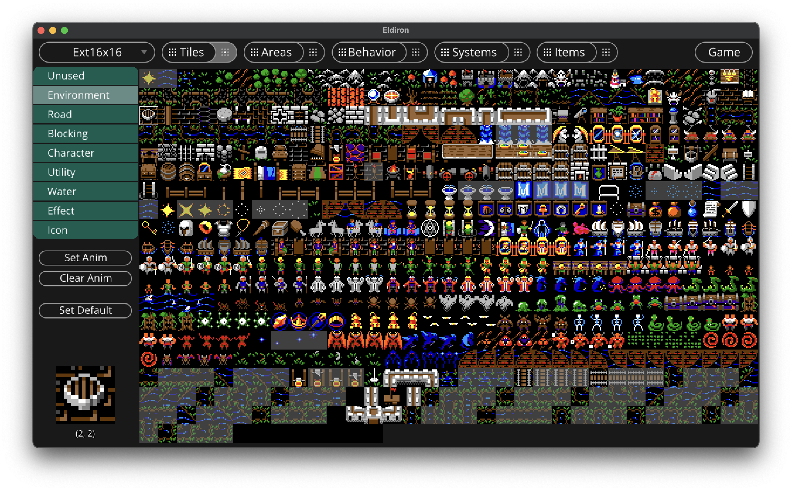

 

Create RPGs for every platform with Eldiron.

The game creator is cross platform and should run on all Desktops. The game engine will work on Desktops but also on iOS and Android devices and any other device Rust compiles on. It is designed from the ground up to be extremely portable.

Eldiron comes with a range of freely usable tilemaps for environment and characters, however you can of course use your own tilemaps, see the instructions below.

The game engine contains a client and server modules, although currently no multi-player options exist yet, the code has been written with multi-player support in mind from the ground up.

Join the community on [Discord](https://discord.gg/ZrNj6baSZU).

## Design Goals

* Run everywhere.
* Keep the engine design flexible, so even if I target Ultima 4 / 5 games (or any game with square tiles) for v1, it will be possible to add support for other perspectives and game types after v1.
* Develop the engine design with multi-player support in mind from the ground up (instances or MMORPGs etc).
* Provide a set of game assets so that users can instantly start their own games.
* Develop a node based Behavior AI system which is easy to use but powerful enough to handle every possible aspect of an RPG (combat, crafting, farming, exploration etc.).

## Why ?

I played the Ultima games day and night in my youth so I decided to create my own similar games as I have some time to spare (what could be a better hobby ?), and on the way also develop a game creator for this type of game which I need for my own game anyway.

## Installation

Eldiron is written in Rust, to run it you have to install Rust and its package manager cargo. Please follow the instructions on this [page](https://www.rust-lang.org/tools/install).

After you successfully installed Rust, check out this repository (or download the source via a .zip file), open a terminal, navigate to the Eldiron directory and start Eldiron with `cargo run --release`.

At a later stage I will provide pre-build binaries for each platform.

## The Tiles View (90% Done)

In the Tiles view you can assign roles and animations to individual tiles in the currently available tilemaps.

Eldiron reads all assets from the assets directory, this is a top level directory in this repository. If you want to add your own tilemaps to Eldiron you will need to paste the tilemap image into the assets/tilemaps directory. Note that right now only tilemaps with square tiles are supported.

There are currently 2 tilemaps available, both with tiles in 16x16, the basic one contains tiles similar to Ultima 4 and the extended one has tiles similar to Ultima 5.

You can multi-select a range of tiles (via mouse click and drag) and by clicking the *Set Anim* button you create an animation for the first tile in the range. The other tiles will be set to *Unused* by default.

The *Clear Anim* button will remove an animation sequence form the currently selected tile.

The *Set Default* button will set the currently selected tile as the default tile of the tilemap, it will be shown as a tilemap icon in the tilemap overview.

The roles a tile can have are:

* **Unused** - This tile is ignored and will not be shown in the area editor.
* **Environment** - This is the default tile type for any kind of non blocking terrain. Use it for grass, floors etc.
* **Road** - Same as Environment but the AI in the upcoming Pathfinder node will prefer road tiles over environment tiles.
* **Blocking** - Every environment tile which is not accessible to the player, like rocks, mountains, walls etc.
* **Character** - Character tiles, like animation tiles for a warrior.
* **Utility** - Utility character tiles. Like a ship or a horse.
* **Water** - Water tiles. Tiles where a ship can go.
* **Effect** - Effect tiles, like an explosion.
* **Icon** - Icons.

Note that the behavior and look for tiles in a certain area or for a given tile in general can be freely adjusted via the Behavior node system.

## Areas View (30% Done)

In the areas view you create specific in-game areas like a dungeon, the world itself or cities.

At the bottom of the view you can see the environment tiles of the selected tilemap (or tilemaps).

Select a tile and click in the area to apply the tile to the area map.

While the basic functionality of the area editor is working, many functions are missing:

* Undo / Redo
* Rectangular operations (cut / copy / paste / move / copy) etc.
* Assigning tiles to groups
* Sooner or later we need layers

## Behavior View (25% Done)

In this view you will be able to create any kind of behavior for characters (combat, progression, crafting) or tiles (spawning, traps etc.).

The node system is simple but powerful and should be accessible by everybody. This is where currently the main work is happening.

## Items View (0% Done)

A specialized node view for in game items and their stats, modifiers and special effects.

## Game View (0% Done)

A specialized node view for the overall game logic.

## License

The source and all assets I commissioned for Eldiron are licensed under the MIT. You can use the source and assets freely.

## Support

You can support the Eldiron project by becoming a [Patreon](https://patreon.com/eldiron). I am also looking for art donations. If interested contact me on [Discord](https://discord.gg/ZrNj6baSZU).
